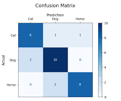
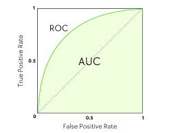

# Metrics for Evaluating Classifier Performance

Building a model is only half the work. The other half is evaluating how well that model performs on data it has never seen before. We use performance metrics to identify if our classifier is reliable or if it is making dangerous mistakes.

---

## 1. The Confusion Matrix: The Foundation
The **Confusion Matrix** is a table used to describe the performance of a classification model. It shows the count of correct and incorrect predictions broken down by each class.

| | **Predicted: YES** | **Predicted: NO** |
| :--- | :--- | :--- |
| **Actual: YES** | **True Positive (TP)** | **False Negative (FN)** |
| **Actual: NO** | **False Positive (FP)** | **True Negative (TN)** |

### **Key Terms:**
* **True Positive (TP):** You predicted "Yes," and it was actually "Yes" (e.g., predicted sick, and they are sick).
* **True Negative (TN):** You predicted "No," and it was actually "No" (e.g., predicted healthy, and they are healthy).
* **False Positive (FP):** You predicted "Yes," but it was actually "No" — **Type I Error**.
* **False Negative (FN):** You predicted "No," but it was actually "Yes" — **Type II Error**.



### **Type I vs Type II Error — Why It Matters**

| Error Type | Statistical Name | Real-World Example | Consequence |
|:---|:---|:---|:---|
| **False Positive (FP)** | Type I Error | Healthy patient diagnosed as sick | Unnecessary treatment, anxiety, cost |
| **False Negative (FN)** | Type II Error | Sick patient diagnosed as healthy | Missed treatment — potentially fatal |

> **Key Insight:** In most real-world problems, one type of error is far more costly than the other. A good evaluation framework must reflect the actual cost of each error type.

### **Multi-Class Confusion Matrix**

For problems with more than 2 classes (e.g., Cat, Dog, Bird), the confusion matrix expands:

|  | Pred: Cat | Pred: Dog | Pred: Bird |
|:---|:---|:---|:---|
| **Act: Cat** | 50 | 2 | 3 |
| **Act: Dog** | 4 | 45 | 1 |
| **Act: Bird** | 1 | 3 | 41 |

* Diagonal = correct predictions.
* Off-diagonal = errors (rows = actual, columns = predicted).
* Per-class metrics are computed using one-vs-rest: treat each class as the "positive" class and all others as "negative."

---

## 2. Core Evaluation Metrics

### **A. Accuracy**
The most basic metric. It tells us what percentage of total predictions were correct.
$$\text{Accuracy} = \frac{TP + TN}{TP + TN + FP + FN}$$
* **When to use:** When your classes are balanced (e.g., 50% Spam, 50% Safe).
* **The Trap:** If 99% of your data is "Safe," a model that says "Safe" for everything will be 99% accurate but 0% useful.

### **B. Precision (Exactness)**
Of all the instances the model predicted as **Positive**, how many were actually **Positive**?
$$\text{Precision} = \frac{TP}{TP + FP}$$
* **Focus:** Minimizing False Positives (e.g., avoiding marking a safe email as Spam).
* **Analogy:** Of all the people I accused of being a thief, what fraction actually were?

### **C. Recall / Sensitivity (Completeness)**
Of all the **Actual Positive** instances, how many did the model correctly catch?
$$\text{Recall} = \frac{TP}{TP + FN}$$
* **Focus:** Minimizing False Negatives (e.g., making sure you don't miss a single Cancer diagnosis).
* **Analogy:** Of all the actual thieves out there, what fraction did I catch?

### **D. F1-Score (The Balance)**
The F1-Score is the "Harmonic Mean" of Precision and Recall. It gives a single score that balances both.
$$\text{F1-Score} = 2 \times \frac{\text{Precision} \times \text{Recall}}{\text{Precision} + \text{Recall}}$$
* **When to use:** When you have an imbalanced dataset and you care about both FP and FN.
* **Why Harmonic Mean?** Unlike the arithmetic mean, the harmonic mean is low if **either** value is low — it forces both Precision and Recall to be high simultaneously.

### **Precision vs Recall — The Tradeoff**

Precision and Recall are in constant tension. Improving one typically worsens the other:

```
High Precision, Low Recall:         High Recall, Low Precision:
  "Only flag things I'm              "Flag everything — catch
   certain about"                     every real case"

  → Few false alarms                 → Many false alarms
  → Miss many real cases             → Catch all real cases
  → Good for: Spam filter            → Good for: Cancer screening
```

The **classification threshold** controls this tradeoff. Lowering the threshold increases Recall (more things flagged positive) but decreases Precision.

---

## 3. Advanced Metrics

### **A. Specificity (True Negative Rate)**
The ability of the classifier to correctly identify Negative instances.
$$\text{Specificity} = \frac{TN}{TN + FP}$$
* Answers: "Of all the actually Negative cases, how many did we correctly label as Negative?"
* Paired with Recall (Sensitivity) — together they give a complete picture of the classifier.

### **B. False Positive Rate (FPR)**
$$\text{FPR} = \frac{FP}{FP + TN} = 1 - \text{Specificity}$$
* Used as the X-axis of the ROC curve.

### **C. ROC Curve and AUC**
* **ROC (Receiver Operating Characteristic):** A graph showing the performance of a classification model at all classification thresholds. It plots **True Positive Rate (Recall)** vs. **False Positive Rate**.
* **AUC (Area Under the Curve):** A single value representing the entire ROC curve.
    * **AUC = 1.0:** Perfect classifier.
    * **AUC = 0.5:** The model is just guessing (like flipping a coin).
    * **AUC < 0.5:** Worse than random — model has inverted predictions.



### **How to Read the ROC Curve**

```
TPR
1.0 |          ___________
    |      ___/           (AUC = 0.92 → Excellent)
    |   __/
    |__/
    |   ___________________
    |  /                   (AUC = 0.5 → Random)
    | /
    |/
    +----------------------→ FPR
   0.0                   1.0
```

* A curve hugging the **top-left corner** = excellent model.
* The **diagonal line** = random classifier (coin flip).
* The **area between** the curve and the diagonal = model's skill.

### **D. Precision-Recall Curve (PR Curve)**
An alternative to ROC for **highly imbalanced** datasets where the negative class dominates.

* Plots **Precision** (Y-axis) vs **Recall** (X-axis) at all thresholds.
* A classifier with **high AUC-PR** is genuinely good at finding the rare positive class.
* Use PR curve when: positive class is rare (e.g., fraud = 0.1% of transactions).

### **E. Matthews Correlation Coefficient (MCC)**
A single metric that considers all four quadrants of the confusion matrix:
$$\text{MCC} = \frac{TP \cdot TN - FP \cdot FN}{\sqrt{(TP+FP)(TP+FN)(TN+FP)(TN+FN)}}$$

* Range: $-1$ to $+1$
* $+1$ = perfect prediction, $0$ = random, $-1$ = perfectly wrong
* **Advantage:** Works well even with severe class imbalance — often more reliable than F1-Score.

### **F. Cohen's Kappa ($\kappa$)**
Measures agreement between the classifier and the true labels, **adjusted for chance**:
$$\kappa = \frac{p_o - p_e}{1 - p_e}$$

Where $p_o$ = observed accuracy and $p_e$ = expected accuracy by random chance.

| $\kappa$ Range | Interpretation |
|:---|:---|
| $< 0$ | Worse than chance |
| $0.0 - 0.2$ | Slight agreement |
| $0.2 - 0.4$ | Fair agreement |
| $0.4 - 0.6$ | Moderate agreement |
| $0.6 - 0.8$ | Substantial agreement |
| $0.8 - 1.0$ | Almost perfect agreement |

---

## 4. Why Accuracy is Not Enough: The "Cancer" Example
Imagine a town where only 1% of people have a rare disease.
1.  A "Lazy" model predicts **Healthy** for everyone.
2.  **Accuracy = 99%** (Since 99% of people are actually healthy).
3.  **Recall = 0%** (Because it missed every single sick person).

In this case, a 99% accurate model is a total failure. This is why we must use **Recall** and **F1-Score** for critical medical or financial data.

### **Numerical Example**

Assume 1000 people: 10 sick, 990 healthy.

**Model A — "Always says Healthy":**

| | Pred: Sick | Pred: Healthy |
|:---|:---|:---|
| Act: Sick | 0 (TP) | 10 (FN) |
| Act: Healthy | 0 (FP) | 990 (TN) |

* Accuracy = 990/1000 = **99%** ← looks great
* Recall = 0/10 = **0%** ← catastrophic
* F1-Score = **0** ← reveals the truth

**Model B — Imperfect but honest classifier:**

| | Pred: Sick | Pred: Healthy |
|:---|:---|:---|
| Act: Sick | 8 (TP) | 2 (FN) |
| Act: Healthy | 50 (FP) | 940 (TN) |

* Accuracy = 948/1000 = **94.8%** ← looks worse!
* Recall = 8/10 = **80%** ← catches 8 of 10 sick patients
* Precision = 8/58 ≈ **13.8%**
* F1-Score = **23.2%** ← low but meaningful

Model B is far more useful in practice despite having lower accuracy.

---

## 5. Cross-Validation: Reliable Performance Estimation

A single train/test split can give misleading results depending on how the data was split. **Cross-validation** provides a more reliable estimate.

### **k-Fold Cross-Validation**
1. Split the dataset into $k$ equal folds (typically $k = 5$ or $10$).
2. Train on $k-1$ folds, test on the remaining fold.
3. Repeat $k$ times — each fold used once as the test set.
4. Report the **mean ± standard deviation** of the metric across all folds.

```
k = 5:
Fold 1: [TEST] [train] [train] [train] [train]
Fold 2: [train] [TEST] [train] [train] [train]
Fold 3: [train] [train] [TEST] [train] [train]
Fold 4: [train] [train] [train] [TEST] [train]
Fold 5: [train] [train] [train] [train] [TEST]
Final score = mean of 5 test scores
```

### **Stratified k-Fold**
For imbalanced datasets, use **stratified** folds — each fold maintains the same class ratio as the full dataset. Prevents a fold from having no positive samples.

### **Leave-One-Out Cross-Validation (LOOCV)**
* $k = n$ (number of samples) — each sample is the test set once.
* Most accurate estimate but computationally expensive.
* Best for very small datasets.

---

## 6. Choosing the Right Metric for the Right Problem

| Application | Primary Concern | Best Metric |
|:---|:---|:---|
| **Cancer Screening** | Don't miss any sick patients | Recall (Sensitivity) |
| **Spam Filtering** | Don't block legitimate emails | Precision |
| **Fraud Detection** | Catch fraud, tolerate some false alarms | F1-Score / Recall |
| **Credit Scoring** | Balance both types of errors | MCC or F1-Score |
| **Search Engine Ranking** | Relevant results at top | Precision@K |
| **General Balanced Dataset** | Overall correctness | Accuracy |
| **Imbalanced Dataset** | True model quality | AUC-PR or MCC |
| **Multi-class Classification** | Per-class + overall | Macro / Weighted F1 |

### **Macro vs Weighted F1 (Multi-class)**

* **Macro F1:** Average F1-Score across all classes — treats each class equally regardless of size.
* **Weighted F1:** Average F1-Score weighted by the number of samples in each class — larger classes have more influence.
* Use **Macro** when all classes are equally important; use **Weighted** when class frequency matters.

---

## 7. Performance Comparison Table

| Metric | Formula | High Value Means... | Best for... |
| :--- | :--- | :--- | :--- |
| **Accuracy** | $(TP+TN)/(TP+TN+FP+FN)$ | Overall correct guesses | Balanced datasets |
| **Precision** | $TP/(TP+FP)$ | Low False Alarms | Spam Detection / Content Moderation |
| **Recall** | $TP/(TP+FN)$ | No missed cases | Disease Diagnosis / Fraud Detection |
| **F1-Score** | $2 \times P \times R / (P+R)$ | Good balance | Imbalanced datasets |
| **Specificity** | $TN/(TN+FP)$ | Few false alarms (negative side) | Medical screening |
| **AUC-ROC** | Area under ROC curve | Good class separation | Comparing models |
| **AUC-PR** | Area under PR curve | Good rare-class detection | Highly imbalanced data |
| **MCC** | (see formula above) | All-round reliability | Imbalanced, critical tasks |

---

## 8. Python Implementation

```python
from sklearn.metrics import (
    confusion_matrix, accuracy_score, precision_score,
    recall_score, f1_score, roc_auc_score, roc_curve,
    precision_recall_curve, matthews_corrcoef,
    cohen_kappa_score, classification_report, ConfusionMatrixDisplay
)
from sklearn.model_selection import cross_val_score, StratifiedKFold
import matplotlib.pyplot as plt
import numpy as np

# --- Assume y_test = true labels, y_pred = model predictions ---
# --- y_prob = predicted probabilities (for ROC/PR curves) ---

# --- 1. Confusion Matrix ---
cm = confusion_matrix(y_test, y_pred)
ConfusionMatrixDisplay(cm, display_labels=["Negative", "Positive"]).plot(cmap="Blues")
plt.title("Confusion Matrix")
plt.tight_layout()
plt.savefig("confusion_matrix.png", dpi=150)
plt.show()

# --- 2. Core Metrics ---
print(f"Accuracy:    {accuracy_score(y_test, y_pred):.4f}")
print(f"Precision:   {precision_score(y_test, y_pred):.4f}")
print(f"Recall:      {recall_score(y_test, y_pred):.4f}")
print(f"F1-Score:    {f1_score(y_test, y_pred):.4f}")
print(f"MCC:         {matthews_corrcoef(y_test, y_pred):.4f}")
print(f"Cohen Kappa: {cohen_kappa_score(y_test, y_pred):.4f}")

# --- 3. Full Classification Report ---
print(classification_report(y_test, y_pred, target_names=["Negative", "Positive"]))

# --- 4. ROC Curve ---
fpr, tpr, thresholds = roc_curve(y_test, y_prob)
auc = roc_auc_score(y_test, y_prob)

plt.figure(figsize=(7, 5))
plt.plot(fpr, tpr, label=f"AUC = {auc:.4f}", color="steelblue")
plt.plot([0, 1], [0, 1], linestyle="--", color="gray", label="Random (AUC=0.5)")
plt.xlabel("False Positive Rate")
plt.ylabel("True Positive Rate (Recall)")
plt.title("ROC Curve")
plt.legend()
plt.grid(True)
plt.tight_layout()
plt.savefig("roc_curve.png", dpi=150)
plt.show()

# --- 5. Precision-Recall Curve ---
precision_vals, recall_vals, _ = precision_recall_curve(y_test, y_prob)

plt.figure(figsize=(7, 5))
plt.plot(recall_vals, precision_vals, color="darkorange")
plt.xlabel("Recall")
plt.ylabel("Precision")
plt.title("Precision-Recall Curve")
plt.grid(True)
plt.tight_layout()
plt.savefig("pr_curve.png", dpi=150)
plt.show()

# --- 6. Cross-Validation with Stratified k-Fold ---
skf = StratifiedKFold(n_splits=5, shuffle=True, random_state=42)

for metric in ["accuracy", "precision", "recall", "f1", "roc_auc"]:
    scores = cross_val_score(model, X, y, cv=skf, scoring=metric)
    print(f"{metric:12s}: {scores.mean():.4f} ± {scores.std():.4f}")

# --- 7. Find the Optimal Classification Threshold ---
# Default threshold is 0.5 — tuning it can improve F1 / Recall
thresholds_range = np.arange(0.1, 0.9, 0.05)
f1_scores = []
for t in thresholds_range:
    y_pred_t = (y_prob >= t).astype(int)
    f1_scores.append(f1_score(y_test, y_pred_t))

best_threshold = thresholds_range[np.argmax(f1_scores)]
print(f"Best Threshold for F1: {best_threshold:.2f} → F1 = {max(f1_scores):.4f}")
```

---

## 9. Quick Reference Card

| Term | Formula | Answers the Question |
|:---|:---|:---|
| Accuracy | $(TP+TN)/N$ | What fraction of all predictions were correct? |
| Precision | $TP/(TP+FP)$ | When I said "Yes," how often was I right? |
| Recall | $TP/(TP+FN)$ | Of all real "Yes" cases, how many did I find? |
| Specificity | $TN/(TN+FP)$ | Of all real "No" cases, how many did I correctly reject? |
| F1-Score | $2PR/(P+R)$ | Am I balancing Precision and Recall? |
| FPR | $FP/(FP+TN)$ | How often do I falsely alarm? |
| AUC-ROC | Area under TPR vs FPR | How well does my model separate classes overall? |
| MCC | (full formula) | Am I reliable even with imbalanced classes? |
| Type I Error | FP | I said "Yes" but was wrong |
| Type II Error | FN | I said "No" but was wrong |