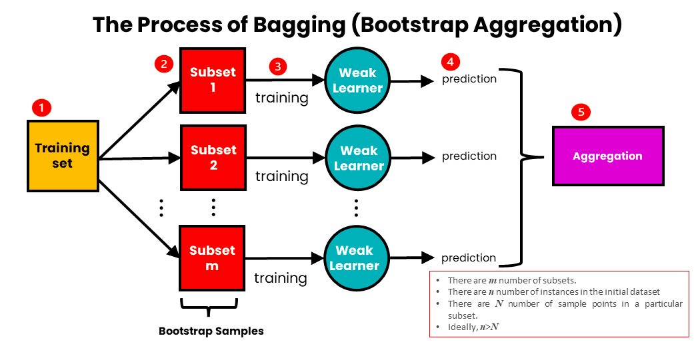
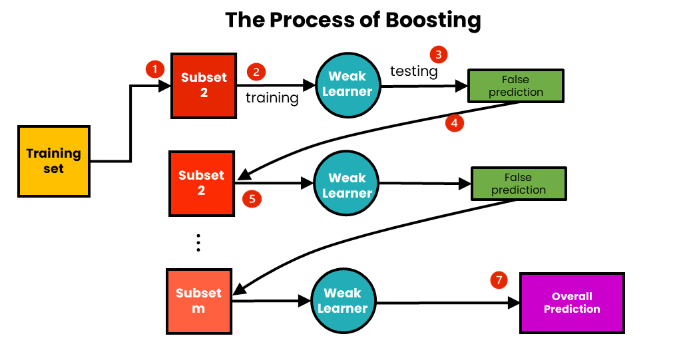
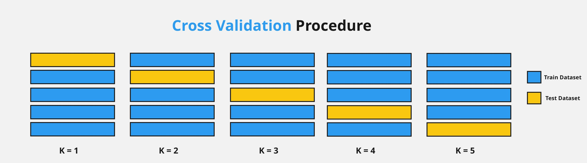

# Techniques to Improve Classification Accuracy

Even with the best algorithms like SVM or Neural Networks, a single model might not be perfect. To reach "industry-grade" accuracy, data scientists use **Ensemble Methods**. The core idea is simple: **"A group of experts is smarter than a single expert."** By combining multiple classifiers, we can reduce errors and create a more robust prediction system.

---

## 1. What are Ensemble Methods?
An ensemble is a collection of models (often called "base classifiers") whose individual predictions are combined (usually by weighted voting) to produce a final, more accurate result.

**The Goal:** To reduce **Bias** (underfitting) and **Variance** (overfitting).


### **Why Ensembles Work — The Math**

Suppose we have $T$ independent classifiers, each with error rate $\varepsilon < 0.5$. The ensemble (majority vote) only makes an error when **more than half** of the classifiers are wrong. By the Binomial distribution:

$$P(\text{ensemble error}) = \sum_{k=\lceil T/2 \rceil}^{T} \binom{T}{k} \varepsilon^k (1-\varepsilon)^{T-k}$$

**Example:** 25 classifiers each with error = 0.35:
$$P(\text{ensemble error}) \approx 0.06$$

A single classifier has 35% error. The ensemble has only 6% error. That's the power of combining weak learners.

### **Two Sources of Error — Bias vs. Variance**

| Error Source | Cause | Symptom | Fix |
|:---|:---|:---|:---|
| **Bias** | Model too simple | Underfitting — bad on training and test data | Boosting |
| **Variance** | Model too complex | Overfitting — great on training, bad on test | Bagging |
| **Irreducible** | Noise in the data | Cannot be removed | Data cleaning |

$$\text{Total Error} = \text{Bias}^2 + \text{Variance} + \text{Irreducible Noise}$$

---

## 2. Bagging (Bootstrap Aggregating)
Bagging aims to reduce the **variance** of a classifier. It is most effective for "unstable" algorithms like Decision Trees.

* **How it works:**
    1. It creates multiple "Bootstrap" samples (subsets) of the training data by picking data points randomly **with replacement**.
    2. It trains a separate classifier on each subset.
    3. For a new data point, it takes a **Majority Vote** from all the classifiers (classification) or **average** (regression).
* **Famous Example:** **Random Forest** (An ensemble of many Decision Trees).



### **Bootstrap Sampling — In Detail**

Given a dataset of $n$ samples, each bootstrap sample also has $n$ samples but drawn **with replacement**:
* Some samples appear multiple times.
* On average, each bootstrap sample contains about **63.2%** of the original unique samples.
* The remaining **36.8%** — never picked — are called the **Out-Of-Bag (OOB)** samples.

$$P(\text{sample not picked in one draw}) = \left(1 - \frac{1}{n}\right)^n \xrightarrow{n \to \infty} e^{-1} \approx 0.368$$

### **Out-Of-Bag (OOB) Error Estimation**

The OOB samples act as a free built-in validation set — no separate cross-validation needed:
1. For each training sample $x_i$, collect predictions only from trees that did **not** use $x_i$ in their bootstrap sample.
2. Aggregate these predictions (vote/average).
3. Compare to the true label → OOB Error.

This is particularly useful when data is scarce.

### **Random Forest — Bagging's Most Famous Child**

Random Forest extends Bagging by adding **random feature selection** at each split:

| Feature | Standard Bagging | Random Forest |
|:---|:---|:---|
| Bootstrap samples | ✅ Yes | ✅ Yes |
| Features per split | All features | Random subset ($\sqrt{p}$ for classification, $p/3$ for regression) |
| Tree correlation | High (similar splits) | Low (de-correlated trees) |
| Generalization | Good | Better |

**Why random features?** If one very strong feature exists, all trees would use it at the root → correlated trees → no diversity → no variance reduction. Random feature sampling forces trees to explore different patterns.

---

## 3. Boosting
Boosting aims to reduce **bias**. Unlike Bagging, where models are trained in parallel, Boosting trains models **sequentially**.

* **How it works:**
    1. It trains a simple base model.
    2. It identifies which data points the model got **wrong**.
    3. It gives those "difficult" data points a **higher weight** and trains the next model to focus specifically on them.
    4. This continues until the errors are minimized.
* **Famous Examples:** **AdaBoost** (Adaptive Boosting), **XGBoost**, and **Gradient Boosting**.



### **AdaBoost — Step-by-Step Mechanics**

1. **Initialise:** Give each training sample equal weight: $w_i = \frac{1}{n}$.
2. **Train:** Fit a weak classifier $h_t$ on weighted data.
3. **Measure Error:**
$$\varepsilon_t = \sum_{i: h_t(x_i) \neq y_i} w_i$$
4. **Compute Classifier Weight:**
$$\alpha_t = \frac{1}{2} \ln\left(\frac{1 - \varepsilon_t}{\varepsilon_t}\right)$$
   * High $\alpha_t$ → classifier was good (trusted more in the final vote).
   * $\alpha_t = 0$ → classifier was random (ignored).
5. **Update Sample Weights:**
   * Misclassified samples: $w_i \leftarrow w_i \cdot e^{\alpha_t}$ ← increase weight
   * Correctly classified: $w_i \leftarrow w_i \cdot e^{-\alpha_t}$ ← decrease weight
   * Normalise so weights sum to 1.
6. **Final Prediction:**
$$H(x) = \text{sign}\left(\sum_{t=1}^{T} \alpha_t h_t(x)\right)$$

### **Gradient Boosting — The Modern Powerhouse**

Gradient Boosting frames boosting as **gradient descent in function space**:
* Each new tree fits the **residual errors** (negative gradients of the loss) of the current ensemble.
* The ensemble prediction is updated:
$$F_{t}(x) = F_{t-1}(x) + \eta \cdot h_t(x)$$

Where $\eta$ is the learning rate (shrinkage). Smaller $\eta$ → more trees needed → better generalisation.

### **XGBoost, LightGBM, CatBoost**

| Library | Key Innovation | Speed | Best For |
|:---|:---|:---|:---|
| **XGBoost** | Regularised gradient boosting, tree pruning | Fast | Tabular data, Kaggle competitions |
| **LightGBM** | Leaf-wise tree growth, histogram binning | Fastest | Very large datasets |
| **CatBoost** | Native categorical feature handling | Fast | Data with many categorical features |

---

## 4. Stacking (Stacked Generalisation)

Stacking is a more sophisticated ensemble method that uses a **meta-learner** to combine the predictions of base classifiers.

**How it works:**
1. Train $T$ diverse base classifiers (e.g., SVM, KNN, Decision Tree) on the training data.
2. Use their predictions as **new features** for a second-level "meta-classifier."
3. Train the meta-classifier on these predictions.
4. For a new point: run through all base classifiers → feed predictions into meta-classifier → final output.

```
Input X  →  [SVM]        →  Pred_SVM  ─┐
         →  [KNN]        →  Pred_KNN  ─┤→ [Meta-Learner] → Final Prediction
         →  [DecTree]    →  Pred_DT   ─┘
```

**Key difference from Bagging/Boosting:** Base classifiers in Stacking are **different algorithms** (heterogeneous), not the same algorithm on different data samples.

---

## 5. Bagging vs. Boosting vs. Stacking

| Feature | Bagging | Boosting | Stacking |
| :--- | :--- | :--- | :--- |
| **Goal** | Reduce Variance | Reduce Bias | Reduce both |
| **Training Style** | Parallel | Sequential | Two levels |
| **Data Selection** | Random sampling with replacement | Weighted sampling based on error | Full data (base) + CV predictions (meta) |
| **Base Classifiers** | Same algorithm, different data | Same algorithm, different weights | Different algorithms |
| **Combining Method** | Majority vote / Average | Weighted vote ($\alpha_t$) | Meta-learner |
| **Best For** | Unstable, high-variance models | Weak learners, high-bias models | Heterogeneous model combination |
| **Famous Example** | Random Forest | AdaBoost, XGBoost | Blending in Kaggle competitions |
| **Overfitting Risk** | Low | Moderate (if too many rounds) | Low (if meta-learner is regularised) |

---

## 6. Other Accuracy Improvement Techniques

### **A. Cross-Validation (K-Fold)**
Instead of just splitting data into "Train" and "Test" once, we divide the data into $K$ parts. We train $K$ times, each time using a different part as the "Test" set. This ensures our accuracy isn't just a result of a "lucky" split.



**Choosing K:**

| K Value | Training Size | Variance of Estimate | Computational Cost |
|:---|:---|:---|:---|
| K = 2 | 50% | High | Very low |
| K = 5 | 80% | Moderate | Moderate |
| K = 10 | 90% | Low | High |
| K = n (LOOCV) | 99.9% | Very low | Very high |

### **B. Feature Engineering & Selection**
Accuracy improves when you remove "noisy" or irrelevant attributes. Using techniques like **PCA (Principal Component Analysis)** helps keep only the most important information.

**Feature Selection Methods:**

| Method | Strategy | Example |
|:---|:---|:---|
| **Filter** | Score features independently of the model | Correlation, Chi-Square, Mutual Information |
| **Wrapper** | Use the model to evaluate subsets | Recursive Feature Elimination (RFE), Forward Selection |
| **Embedded** | Feature selection happens during training | LASSO (L1), Decision Tree importance |

**PCA (Dimensionality Reduction):**

PCA finds the directions (principal components) of maximum variance in the data and projects it onto a lower-dimensional space:
$$\mathbf{Z} = \mathbf{X} \cdot \mathbf{V}_k$$

Where $\mathbf{V}_k$ = top $k$ eigenvectors of the covariance matrix. Retain components that explain $\geq 95\%$ of variance.

### **C. Handling Imbalanced Data**

If you have 99% "No" and 1% "Yes" data, the model will be biased. Techniques include:

**Over-sampling (Minority class):**
* **Random Over-sampling:** Duplicate random minority samples.
* **SMOTE (Synthetic Minority Over-sampling Technique):** Create synthetic samples by interpolating between existing minority samples.
$$x_{new} = x_i + \lambda \cdot (x_{nn} - x_i), \quad \lambda \in [0, 1]$$

**Under-sampling (Majority class):**
* **Random Under-sampling:** Randomly remove majority samples.
* **Tomek Links:** Remove majority samples that are borderline (closest to minority points).

**Algorithm-level fixes:**
* **Class Weights:** Penalise misclassification of the minority class more heavily (`class_weight='balanced'` in sklearn).
* **Threshold Tuning:** Lower the classification threshold to increase recall for the minority class.

| Technique | When to Use | Risk |
|:---|:---|:---|
| SMOTE | Small to medium imbalance | May create noisy synthetic samples |
| Under-sampling | Very large majority class | Loss of useful majority information |
| Class weights | Quick fix, no data change | May not fully resolve extreme imbalance |
| Threshold tuning | Post-training adjustment | Requires careful metric monitoring |

### **D. Hyperparameter Tuning**

Finding the best hyperparameters systematically:

**Grid Search:** Tests all combinations in a defined grid.
```
C = [0.1, 1, 10, 100]  ×  gamma = [0.001, 0.01, 0.1]  →  12 combinations
```

**Random Search:** Tests random combinations — faster when the grid is large.
* Bergstra & Bengio (2012): Random search finds good configurations as fast as Grid Search with far fewer evaluations.

**Bayesian Optimisation:** Uses past evaluation results to intelligently choose the next hyperparameter set to try (e.g., Optuna, Hyperopt).

| Method | Exhaustive? | Speed | Best For |
|:---|:---|:---|:---|
| Grid Search | Yes | Slow | Small parameter spaces |
| Random Search | No | Fast | Large parameter spaces |
| Bayesian Opt. | No | Fastest (informed) | Expensive models |

---

## 7. Summary: The Recipe for High Accuracy

1. **Clean the Data:** Remove noise and handle missing values.
2. **Normalize:** Ensure all attributes are on the same scale (essential for KNN/SVM).
3. **Select Features:** Keep only the attributes that actually matter.
4. **Handle Imbalance:** Use SMOTE, under-sampling, or class weights if needed.
5. **Use Ensembles:** If one model isn't enough, use a **Random Forest** or **XGBoost** to combine strengths.
6. **Tune Hyperparameters:** Use Grid Search or Bayesian Optimisation to find the best settings.
7. **Validate Properly:** Use **Stratified K-Fold Cross-Validation** to get a reliable accuracy estimate.
8. **Choose the Right Metric:** Use F1/Recall for imbalanced data, not raw Accuracy.

---

## 8. Ensemble Methods in Practice — When to Use What

```
Is your single model overfitting (high variance)?
    → YES → Use BAGGING (Random Forest)
    → NO  → Is your model underfitting (high bias)?
                → YES → Use BOOSTING (XGBoost, AdaBoost)
                → NO  → Do you have diverse, strong base models?
                            → YES → Use STACKING
                            → NO  → Tune hyperparameters and clean data first
```

---

## 9. Python Implementation

```python
from sklearn.ensemble import (
    BaggingClassifier, RandomForestClassifier,
    AdaBoostClassifier, GradientBoostingClassifier,
    StackingClassifier
)
from sklearn.tree import DecisionTreeClassifier
from sklearn.svm import SVC
from sklearn.neighbors import KNeighborsClassifier
from sklearn.linear_model import LogisticRegression
from sklearn.model_selection import cross_val_score, StratifiedKFold
from sklearn.metrics import f1_score
from imblearn.over_sampling import SMOTE
import xgboost as xgb
import numpy as np

skf = StratifiedKFold(n_splits=5, shuffle=True, random_state=42)

# --- 1. Bagging ---
bagging = BaggingClassifier(
    estimator=DecisionTreeClassifier(),
    n_estimators=100,
    max_samples=0.8,        # 80% of data per bootstrap sample
    bootstrap=True,
    oob_score=True,         # OOB error estimation
    random_state=42
)
bagging.fit(X_train, y_train)
print(f"Bagging OOB Score: {bagging.oob_score_:.4f}")

# --- 2. Random Forest ---
rf = RandomForestClassifier(
    n_estimators=200,
    max_features='sqrt',    # sqrt(p) features per split
    max_depth=None,
    oob_score=True,
    random_state=42
)
rf.fit(X_train, y_train)
print(f"Random Forest OOB Score: {rf.oob_score_:.4f}")

# Feature importances
for name, imp in sorted(zip(feature_names, rf.feature_importances_),
                         key=lambda x: -x[1]):
    print(f"  {name}: {imp:.4f}")

# --- 3. AdaBoost ---
ada = AdaBoostClassifier(
    estimator=DecisionTreeClassifier(max_depth=1),  # "Stump"
    n_estimators=200,
    learning_rate=0.5,
    random_state=42
)
scores = cross_val_score(ada, X, y, cv=skf, scoring='f1')
print(f"AdaBoost F1: {scores.mean():.4f} ± {scores.std():.4f}")

# --- 4. Gradient Boosting ---
gbt = GradientBoostingClassifier(
    n_estimators=200,
    learning_rate=0.05,    # Small learning rate → more trees needed
    max_depth=4,
    subsample=0.8,         # Stochastic GB: use 80% of data per tree
    random_state=42
)
scores = cross_val_score(gbt, X, y, cv=skf, scoring='f1')
print(f"GBT F1: {scores.mean():.4f} ± {scores.std():.4f}")

# --- 5. XGBoost ---
xgb_clf = xgb.XGBClassifier(
    n_estimators=300,
    learning_rate=0.05,
    max_depth=6,
    subsample=0.8,
    colsample_bytree=0.8,  # Random features like Random Forest
    use_label_encoder=False,
    eval_metric='logloss',
    random_state=42
)
scores = cross_val_score(xgb_clf, X, y, cv=skf, scoring='f1')
print(f"XGBoost F1: {scores.mean():.4f} ± {scores.std():.4f}")

# --- 6. Stacking ---
base_learners = [
    ('svm',    SVC(kernel='rbf', probability=True)),
    ('knn',    KNeighborsClassifier(n_neighbors=5)),
    ('rf',     RandomForestClassifier(n_estimators=100, random_state=42))
]
meta_learner = LogisticRegression()
stacking = StackingClassifier(
    estimators=base_learners,
    final_estimator=meta_learner,
    cv=5
)
scores = cross_val_score(stacking, X, y, cv=skf, scoring='f1')
print(f"Stacking F1: {scores.mean():.4f} ± {scores.std():.4f}")

# --- 7. SMOTE for Imbalanced Data ---
smote = SMOTE(sampling_strategy='auto', random_state=42)
X_resampled, y_resampled = smote.fit_resample(X_train, y_train)
print(f"Before SMOTE: {dict(zip(*np.unique(y_train, return_counts=True)))}")
print(f"After SMOTE:  {dict(zip(*np.unique(y_resampled, return_counts=True)))}")

# --- 8. Compare All Methods ---
models = {
    "Random Forest":       rf,
    "AdaBoost":            ada,
    "Gradient Boosting":   gbt,
    "XGBoost":             xgb_clf,
    "Stacking":            stacking
}
print("\n--- Model Comparison (F1 Score, 5-Fold CV) ---")
for name, model in models.items():
    scores = cross_val_score(model, X, y, cv=skf, scoring='f1')
    print(f"{name:22s}: {scores.mean():.4f} ± {scores.std():.4f}")
```

---

## 10. Quick Reference Card

| Technique | Reduces | How | Best Algorithm |
|:---|:---|:---|:---|
| Bagging | Variance | Parallel trees on bootstrap samples | Random Forest |
| Boosting | Bias | Sequential weighted learning | XGBoost, AdaBoost |
| Stacking | Both | Meta-learner on diverse classifiers | Custom blend |
| Cross-Validation | Evaluation error | Multiple train/test splits | Stratified K-Fold |
| Feature Selection | Noise | Remove irrelevant attributes | RFE, LASSO |
| SMOTE | Class bias | Synthetic minority samples | imbalanced-learn |
| Hyperparameter Tuning | Suboptimal settings | Grid/Random/Bayesian search | Optuna, GridSearchCV |
| Normalisation | Scale bias | Min-Max or Z-score scaling | StandardScaler |