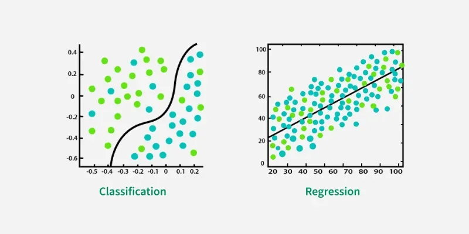
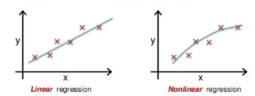

# Prediction - Regression Analysis

### **Description**
In data mining, **Prediction** is the process of identifying patterns in historical data to forecast future numerical outcomes. While classification focuses on "Which category?", prediction focuses on "How much?".
 **Regression Analysis** is the primary statistical methodology used for this task. It builds a mathematical relationship between known variables to predict a continuous, ordered value.

---

## 1. What is Regression Analysis?
Regression is a way to model the relationship between a **Dependent Variable** (the target result) and one or more **Independent Variables** (the input factors).

* **Dependent Variable ($Y$):** The value you are trying to predict (e.g., Temperature, Price).
* **Independent Variable ($X$):** The variables that influence the target (e.g., Humidity, Location).

---

## 2. Types of Regression Analysis

### **A. Linear Regression**
It assumes the relationship between $X$ and $Y$ is a straight line.
* **Simple Linear Regression:** Predicts $Y$ using only one $X$.
  $$Y = \beta_0 + \beta_1 X + \epsilon$$
* **Multiple Linear Regression:** Predicts $Y$ using a combination of multiple $X$ variables.
  $$Y = \beta_0 + \beta_1 X_1 + \beta_2 X_2 + \dots + \beta_n X_n + \epsilon$$

### **B. Non-Linear (Polynomial) Regression**
Used when data points don't follow a straight line but rather a curve or a wave.

### **C. Logistic Regression**
**Important Note:** Despite having "Regression" in its name, Logistic Regression is used for **Classification**. It maps any real-valued number into a value between 0 and 1 using the Sigmoid function, predicting probabilities for discrete classes.

[Image comparing Linear Regression line vs Logistic Regression S-curve]

---

## 3. How the Model Learns: Ordinary Least Squares (OLS)
The most common way to train a regression model is **Ordinary Least Squares (OLS)**. 

1. **Residuals:** For every data point, the model calculates the vertical distance (error) between the actual point and the predicted line.
2. **Squaring:** It squares these distances (to remove negative values and punish large errors).
3. **Minimization:** The algorithm mathematically finds the line where the **Sum of Squared Errors (SSE)** is the lowest possible.

---

## 4. Evaluation Metrics: Measuring "Closeness"
Since we aren't predicting "Right/Wrong" labels, we measure how "close" our predicted numbers are to the actual numbers.

* **Mean Absolute Error (MAE):** The average magnitude of errors (ignores direction).
* **Mean Squared Error (MSE):** The average of squared errors. It is highly sensitive to outliers.
* **Root Mean Squared Error (RMSE):** The square root of MSE. It is the most popular metric as it is in the same units as the target variable ($Y$).
* **Coefficient of Determination ($R^2$):** Measures the "Goodness of Fit." 
    * $R^2 = 1$: Perfect prediction.
    * $R^2 = 0$: The model is no better than just guessing the average value.

---

## 5. Challenges in Regression

* **Multicollinearity:** When your "independent" variables are actually dependent on each other (e.g., trying to predict house price using both "Total Square Feet" and "Number of Rooms," as they usually increase together).
* **Outliers:** A single extreme value (like a mansion in a middle-class neighborhood) can "pull" the regression line away from the majority of data, ruining the model.
* **Heteroscedasticity:** When the "noise" or error in our data isn't constant across all values of $X$.

---

## 6. Real-World Applications
1. **Sales Forecasting:** Predicting how many units of a product will sell next month based on past trends.
2. **Weather Prediction:** Estimating the exact degrees of temperature or centimeters of rainfall.
3. **Economic Trends:** Predicting the inflation rate or GDP growth for a country.
4. **Health Metrics:** Predicting a person's life expectancy based on lifestyle habits and genetics.

---

## 7. Summary Comparison: Classification vs. Prediction

| Feature | Classification | Prediction (Regression) |
| :--- | :--- | :--- |
| **Output Type** | Discrete / Categorical (e.g., Safe/Risky) | Continuous / Numeric (e.g., $50,000) |
| **Logic** | Finds boundaries to separate classes. | Finds a line/curve to fit the trend. |
| **Algorithms** | Decision Trees, Naive Bayes, SVM. | Linear Regression, Polynomial Regression. |
| **Key Metric** | Accuracy / F1-Score. | RMSE / R-Squared. |

---
