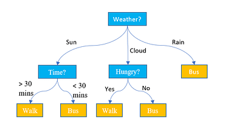
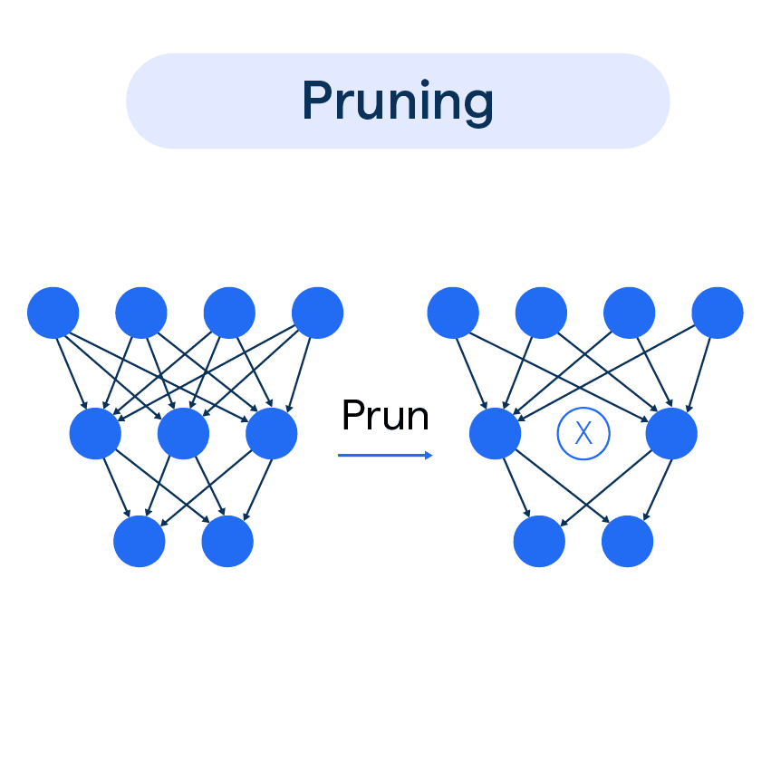

# Decision Tree Induction

### **"The Expert's Logic Flow"**
When an expert doctor diagnoses a patient, they don't look at 50 symptoms at once. They start with the most critical question (e.g., "Does the patient have a fever?"). Based on that answer, they ask the next most relevant question.

In Data Mining, **Decision Tree Induction** is the process of extracting these "Expert Rules" from a mountain of raw data. It turns a messy database into a clean, logical flowchart.

---

## **1. The Anatomy of a Decision Tree**
A decision tree is a directed graph consisting of:

* **Root Node:** The topmost node that represents the entire dataset. It is chosen because it provides the best "split" (highest information gain).
* **Internal (Decision) Nodes:** These represent a test on a specific attribute (e.g., `Age`, `Credit_Score`).
* **Branches:** These represent the outcome of the test (e.g., `Age < 30` vs `Age >= 30`).
* **Leaf Nodes (Terminal Nodes):** These represent the final class label (e.g., `Loan Approved` or `Loan Rejected`). A leaf node has no children.



> **Key Insight:** A decision tree with depth $d$ can have at most $2^d$ leaf nodes (in the binary case). Deeper trees are more expressive but more prone to overfitting.

---

## **2. How the Tree "Decides"**
The tree doesn't pick attributes randomly. It uses **Attribute Selection Measures (ASM)** to determine which attribute creates the "purest" child nodes.

### **A. Entropy (The Measure of Chaos)**
Entropy measures the impurity of a dataset. If a dataset is 50% "Yes" and 50% "No", entropy is at its maximum ($1.0$). If it is 100% "Yes", entropy is $0$.

The formula for Entropy $H(S)$ is:
$$H(S) = \sum_{i=1}^{c} -p_i \log_2(p_i)$$

Where:
* $p_i$ = proportion of class $i$ in set $S$
* $c$ = number of distinct classes
* Convention: $0 \cdot \log_2(0) = 0$

**Entropy Values at a Glance:**

| Scenario | Entropy |
|:---|:---|
| 100% one class | 0.0 (perfectly pure) |
| 50% / 50% two classes | 1.0 (maximum disorder) |
| 33% / 33% / 33% three classes | 1.585 |
| 25% / 25% / 25% / 25% four classes | 2.0 |

### **B. Information Gain (ID3 Algorithm)**
This measures the reduction in entropy after a dataset is split on an attribute $A$.
$$\text{Gain}(S, A) = H(S) - \sum_{v \in \text{Values}(A)} \frac{|S_v|}{|S|} H(S_v)$$

> **Drawback of Information Gain:** It is biased toward attributes with many distinct values (e.g., `Customer_ID` gives perfect splits but is useless for prediction). C4.5 addresses this with **Gain Ratio**.

### **C. Gain Ratio (C4.5 Algorithm)**
Gain Ratio normalizes Information Gain by the split's own entropy (called **Split Information**), penalizing attributes that create many branches.

$$\text{GainRatio}(S, A) = \frac{\text{Gain}(S, A)}{\text{SplitInfo}(S, A)}$$

$$\text{SplitInfo}(S, A) = -\sum_{v \in \text{Values}(A)} \frac{|S_v|}{|S|} \log_2 \frac{|S_v|}{|S|}$$

### **D. Gini Index (CART Algorithm)**
The Gini Index measures the probability that a randomly chosen element would be incorrectly classified if it were randomly labeled according to the class distribution.

$$\text{Gini}(S) = 1 - \sum_{i=1}^{c} p_i^2$$

For a binary split on attribute $A$:
$$\text{Gini}_A(S) = \frac{|S_1|}{|S|} \text{Gini}(S_1) + \frac{|S_2|}{|S|} \text{Gini}(S_2)$$

**The attribute with the lowest Gini is chosen.**

**Gini vs. Entropy comparison:**

| Dataset | Entropy | Gini |
|:---|:---|:---|
| 50% / 50% | 1.0 | 0.5 |
| 70% / 30% | 0.881 | 0.42 |
| 90% / 10% | 0.469 | 0.18 |
| 100% / 0% | 0.0 | 0.0 |

Both measures reach 0 for pure nodes and peak for equal class distributions. In practice, they yield similar trees — Gini is computationally faster (no logarithm).

---

## **3. The Induction Process (Recursive Partitioning)**
The algorithm follows a **Greedy, Top-Down Recursive** approach:

1.  **Step 1: Calculate Entropy.** Calculate the entropy of the current target class.
2.  **Step 2: Test All Attributes.** Calculate the Information Gain (or Gini Index) for every available attribute.
3.  **Step 3: Select the Winner.** The attribute with the highest Gain (or lowest Gini) becomes the decision node.
4.  **Step 4: Split the Data.** Divide the records into subsets based on the values of the winning attribute.
5.  **Step 5: Recursion.** Repeat the process for each subset (child node).

### **When does the algorithm stop?**
A branch stops growing (becomes a leaf) when:
* **Pure Node:** All records in the subset belong to the same class.
* **No More Attributes:** There are no remaining attributes to split on.
* **No More Samples:** The subset is empty.
* **Min Samples Threshold:** (Pre-pruning) A node has fewer samples than a defined minimum.

### **Handling Splits: Categorical vs. Numerical Attributes**

**Categorical attributes** (e.g., `Weather = {Sunny, Cloudy, Rainy}`):
* **ID3 / C4.5:** Multi-way split — one branch per unique value.
* **CART:** Binary split — groups values into two subsets (e.g., `{Sunny}` vs. `{Cloudy, Rainy}`).

**Numerical attributes** (e.g., `Age = 25.5`):
* The algorithm sorts values and evaluates candidate thresholds (e.g., midpoints between consecutive values).
* The threshold with the best gain is used (e.g., `Age ≤ 30` vs. `Age > 30`).
* **C4.5** converts continuous attributes to binary by finding the best cut point.

---

## **4. Combatting Overfitting: Tree Pruning**
A tree that is too deep is like a student who memorizes a practice exam but fails the real one because the questions changed slightly. This is **Overfitting**.

* **Pre-pruning (Early Stopping):** Stop the tree before it becomes too complex. For example, "Don't split if a node has fewer than 10 records."
* **Post-pruning (Simplification):** Let the tree grow to its full, complex size, then remove branches that don't contribute to accuracy on a "Validation" dataset.



### **Pre-Pruning Criteria (Early Stopping)**
| Criterion | Description |
|:---|:---|
| **Min Samples Split** | Don't split if the node has fewer than $n$ samples |
| **Min Samples Leaf** | Don't create a leaf with fewer than $n$ samples |
| **Max Depth** | Cap the tree at depth $d$ |
| **Max Leaf Nodes** | Limit total number of leaf nodes |
| **Min Impurity Decrease** | Only split if the gain exceeds a threshold $\epsilon$ |

### **Post-Pruning Methods**

#### **Reduced Error Pruning (REP)**
1. Grow the full tree on training data.
2. For each non-leaf node (bottom-up), temporarily replace its subtree with the majority class leaf.
3. Measure accuracy on a **validation set**.
4. Permanently prune the subtree if accuracy does **not decrease**.
5. Repeat until no more pruning improves (or maintains) accuracy.

#### **Cost-Complexity Pruning (Weakest Link — used in CART)**
Defines a cost-complexity measure:
$$R_\alpha(T) = R(T) + \alpha |T|$$

Where $R(T)$ is the training error, $|T|$ is the number of leaves, and $\alpha$ is the **complexity parameter**. As $\alpha$ increases, simpler trees are preferred. The optimal $\alpha$ is found via cross-validation.

#### **Minimum Description Length (MDL) Pruning**
Rooted in information theory — the best model is the one that minimizes the total description length of the model plus the data given the model. A pruned subtree is kept only if it reduces total description length.

---

## **5. Comparison of Popular Induction Algorithms**

| Algorithm | Developed By | Measure Used | Type of Split | Handles Missing Values | Handles Continuous Attributes |
| :--- | :--- | :--- | :--- | :--- | :--- |
| **ID3** | Ross Quinlan (1986) | Information Gain | Multi-way split | ❌ No | ❌ No |
| **C4.5** | Ross Quinlan (1993) | Gain Ratio | Multi-way split | ✅ Yes | ✅ Yes |
| **C5.0** | Ross Quinlan | Gain Ratio (boosted) | Multi-way split | ✅ Yes | ✅ Yes |
| **CART** | Breiman et al. (1984) | Gini Index | Strictly Binary (Yes/No) | ✅ Yes (surrogates) | ✅ Yes |

### **How C4.5 Handles Missing Values**
C4.5 uses a **probabilistic fractional assignment**: a record with a missing value for attribute $A$ is split fractionally across all branches of $A$ in proportion to the branch's class distribution. This avoids discarding incomplete records.

### **How CART Handles Missing Values**
CART uses **surrogate splits**: when the primary splitting attribute is missing for a record, a secondary attribute is pre-computed that most closely mimics the primary split's partitioning.

---

## **6. The Full Worked Example (ID3 — Multi-Attribute)**

**Dataset: Predict whether to Play Tennis.**

| Day | Outlook | Temperature | Humidity | Wind | Play? |
|:---|:---|:---|:---|:---|:---|
| D1 | Sunny | Hot | High | Weak | No |
| D2 | Sunny | Hot | High | Strong | No |
| D3 | Overcast | Hot | High | Weak | Yes |
| D4 | Rain | Mild | High | Weak | Yes |
| D5 | Rain | Cool | Normal | Weak | Yes |
| D6 | Rain | Cool | Normal | Strong | No |
| D7 | Overcast | Cool | Normal | Strong | Yes |
| D8 | Sunny | Mild | High | Weak | No |
| D9 | Sunny | Cool | Normal | Weak | Yes |
| D10 | Rain | Mild | Normal | Weak | Yes |
| D11 | Sunny | Mild | Normal | Strong | Yes |
| D12 | Overcast | Mild | High | Strong | Yes |
| D13 | Overcast | Hot | Normal | Weak | Yes |
| D14 | Rain | Mild | High | Strong | No |

**Total:** 14 records. Yes = 9, No = 5.

### **Step 1: Total Entropy of S**
$$H(S) = -\frac{9}{14}\log_2\frac{9}{14} - \frac{5}{14}\log_2\frac{5}{14} \approx 0.940$$

### **Step 2: Information Gain for Each Attribute**

**Outlook (Sunny=5, Overcast=4, Rain=5):**
* $H(\text{Sunny}) = -\frac{2}{5}\log_2\frac{2}{5} - \frac{3}{5}\log_2\frac{3}{5} \approx 0.971$
* $H(\text{Overcast}) = 0$ (all Yes — pure!)
* $H(\text{Rain}) = -\frac{3}{5}\log_2\frac{3}{5} - \frac{2}{5}\log_2\frac{2}{5} \approx 0.971$
* $\text{Gain}(S, \text{Outlook}) = 0.940 - [\frac{5}{14}(0.971) + \frac{4}{14}(0) + \frac{5}{14}(0.971)] \approx \mathbf{0.246}$

**Wind (Weak=8, Strong=6):**
* $\text{Gain}(S, \text{Wind}) \approx \mathbf{0.048}$

**Humidity (High=7, Normal=7):**
* $\text{Gain}(S, \text{Humidity}) \approx \mathbf{0.151}$

**Temperature (Hot=4, Mild=6, Cool=4):**
* $\text{Gain}(S, \text{Temperature}) \approx \mathbf{0.029}$

### **Step 3: Select Root Node**
**Outlook wins** with the highest gain of **0.246**. It becomes the Root Node.

The `Overcast` branch is immediately a leaf (pure "Yes"). The `Sunny` and `Rain` branches recurse further, eventually splitting on `Humidity` and `Wind` respectively.

---

## **7. Practical Example: Student Pass/Fail**

**Dataset: Predict if a student will "Pass" based on "Study Hours" (High/Low).**

| Student | Study Hours | Result (Class) |
| :--- | :--- | :--- |
| 1 | High | Pass |
| 2 | High | Pass |
| 3 | Low | Fail |
| 4 | Low | Pass |

### **Step 1: Calculate Total Entropy of $S$**
* Total samples = 4. Pass = 3, Fail = 1.
* $Entropy(S) = -(\frac{3}{4} \log_2 \frac{3}{4}) - (\frac{1}{4} \log_2 \frac{1}{4}) \approx \mathbf{0.811}$

### **Step 2: Calculate Entropy for Attribute "Study Hours"**
* **For "High":** 2 samples, both Pass.
    * $Entropy(High) = 0$ (Perfectly pure).
* **For "Low":** 2 samples, 1 Pass, 1 Fail.
    * $Entropy(Low) = -(\frac{1}{2} \log_2 \frac{1}{2}) - (\frac{1}{2} \log_2 \frac{1}{2}) = 1.0$

### **Step 3: Calculate Information Gain**
* $Gain(S, StudyHours) = 0.811 - [(\frac{2}{4} \times 0) + (\frac{2}{4} \times 1.0)]$
* $Gain(S, StudyHours) = 0.811 - 0.5 = \mathbf{0.311}$

**Decision:** Since "Study Hours" provides a gain of 0.311, it is used to split the data. The "High" branch leads directly to a "Pass" leaf.

---

## **8. Decision Trees for Regression (CART Regression Trees)**
Decision trees aren't limited to classification. **Regression Trees** predict a continuous numerical value (e.g., house price).

**Key Differences from Classification Trees:**
* **Splitting Criterion:** Instead of Gini/Entropy, the algorithm minimizes **Mean Squared Error (MSE)** or **Mean Absolute Error (MAE)**.
* **Leaf Value:** The leaf predicts the **mean** of all training samples that fall into that region.

$$\text{MSE}(S) = \frac{1}{|S|} \sum_{i \in S} (y_i - \bar{y})^2$$

The best split minimizes the weighted MSE of the child nodes:
$$\text{Cost}(S, A, v) = \frac{|S_{\text{left}}|}{|S|} \text{MSE}(S_{\text{left}}) + \frac{|S_{\text{right}}|}{|S|} \text{MSE}(S_{\text{right}})$$

**Example:** Predicting house price by `Rooms` and `Location`:
* Split: `Rooms ≤ 3` → Leaf predicts $180,000 (mean of low-room houses)
* Split: `Rooms > 3` → further split by `Location`...

---

## **9. Ensemble Methods: Taking Trees Further**

Single decision trees are powerful, but they suffer from **high variance** (instability). Ensemble methods combine many trees to produce far more robust predictions.

### **A. Bagging (Bootstrap Aggregating)**
* Train $T$ trees, each on a **random bootstrap sample** (sampling with replacement) of the training data.
* For classification: majority vote. For regression: average.
* Reduces variance without increasing bias.

### **B. Random Forest**
An extension of Bagging where each tree is also given a **random subset of features** at each split (typically $\sqrt{p}$ features for classification, $p/3$ for regression).

* This **de-correlates** the trees, making the ensemble more powerful.
* Provides a built-in **Feature Importance** score: how much each feature reduces impurity on average across all trees.

### **C. Boosting (Gradient Boosted Trees)**
Trees are built **sequentially**, where each new tree corrects the errors of the previous ones.

* **AdaBoost:** Assigns higher weights to misclassified samples so the next tree focuses on them.
* **Gradient Boosting (GBM, XGBoost, LightGBM, CatBoost):** Each tree fits the **residual errors** (gradients) of the previous ensemble.

| Method | Trees Built | Variance | Bias | Typical Performance |
|:---|:---|:---|:---|:---|
| Single Decision Tree | 1 | High | Low | Moderate |
| Bagging | Parallel | Low | Low | Good |
| Random Forest | Parallel | Very Low | Low | Very Good |
| Gradient Boosting | Sequential | Low | Very Low | Excellent |

---

## **10. Evaluating a Decision Tree**

### **A. Classification Metrics**

**Confusion Matrix** (for binary classification):

|  | Predicted: Yes | Predicted: No |
|:---|:---|:---|
| **Actual: Yes** | True Positive (TP) | False Negative (FN) |
| **Actual: No** | False Positive (FP) | True Negative (TN) |

From this, key metrics are derived:

$$\text{Accuracy} = \frac{TP + TN}{TP + TN + FP + FN}$$

$$\text{Precision} = \frac{TP}{TP + FP}$$

$$\text{Recall (Sensitivity)} = \frac{TP}{TP + FN}$$

$$\text{F1 Score} = 2 \times \frac{\text{Precision} \times \text{Recall}}{\text{Precision} + \text{Recall}}$$

### **B. Cross-Validation**
To get a reliable estimate of model performance, use **k-fold cross-validation**:
1. Split data into $k$ equal folds.
2. Train on $k-1$ folds, test on the remaining fold.
3. Repeat $k$ times (each fold used once as test set).
4. Report the **average** accuracy across all $k$ runs.

This avoids the pitfall of over-optimistic accuracy from evaluating on training data.

### **C. Regression Metrics**
For regression trees, use:
* **Mean Squared Error (MSE):** $\frac{1}{n}\sum(y_i - \hat{y}_i)^2$
* **Root Mean Squared Error (RMSE):** $\sqrt{\text{MSE}}$ (same units as target)
* **Mean Absolute Error (MAE):** $\frac{1}{n}\sum|y_i - \hat{y}_i|$ (robust to outliers)
* **R² (Coefficient of Determination):** Proportion of variance explained by the model (1.0 = perfect)

---

## **11. Feature Importance in Decision Trees**

One of the most valuable byproducts of a trained decision tree is **feature importance** — a ranking of how much each attribute contributed to the tree's predictive power.

**Impurity-Based Importance (MDI — Mean Decrease in Impurity):**

$$\text{Importance}(f) = \sum_{\text{nodes where } f \text{ is used}} p(t) \cdot \Delta\text{impurity}(t)$$

Where $p(t) = \frac{\text{samples reaching node } t}{\text{total samples}}$ and $\Delta\text{impurity}$ is the impurity reduction at that node.

> **Warning:** MDI importance can be biased toward high-cardinality features (features with many unique values). **Permutation Importance** (shuffle one feature at a time and measure accuracy drop) is a more reliable alternative, especially in Random Forests.

---

## **12. Comparison of Popular Induction Algorithms (Extended)**

| Algorithm | Developed By | Measure Used | Type of Split |
| :--- | :--- | :--- | :--- |
| **ID3** | Ross Quinlan | Information Gain | Multi-way split |
| **C4.5** | Ross Quinlan | Gain Ratio | Multi-way split (handles missing values) |
| **CART** | Breiman et al. | Gini Index | Strictly Binary split (Yes/No) |

---

## **13. Hyperparameter Tuning**

Hyperparameters control the tree's complexity. Tuning them is essential for the best performance.

| Hyperparameter | What It Controls | Too Small → | Too Large → |
|:---|:---|:---|:---|
| `max_depth` | Max tree depth | Underfitting | Overfitting |
| `min_samples_split` | Min samples to split a node | Overfitting | Underfitting |
| `min_samples_leaf` | Min samples in a leaf | Overfitting | Underfitting |
| `max_features` | Features to consider per split | Underfitting | Overfitting |
| `ccp_alpha` | Cost-complexity pruning parameter | Overfitting | Underfitting |

**Grid Search / Random Search** are common strategies for finding the best combination of hyperparameters using cross-validation.

---

## **14. Pros and Cons**

### **The Strengths**
* **Interpretability:** Unlike "Black Box" models like Neural Networks, you can explain exactly why a decision was made.
* **Feature Selection:** The attributes at the top of the tree are the most important variables in your data.
* **Versatility:** Can handle both numerical data (Age, Salary) and categorical data (Gender, Color).
* **No Feature Scaling Required:** Unlike SVM or k-NN, decision trees are invariant to monotone transformations of features (no need to normalize or standardize).
* **Non-Linear Boundaries:** Can capture complex, non-linear decision boundaries through hierarchical splits.
* **Handles Interaction Effects:** Naturally captures feature interactions without explicit encoding.

### **The Weaknesses**
* **Instability:** A small change in the data can lead to a completely different tree structure.
* **Bias toward many-valued attributes:** Standard Information Gain favors attributes like `Social Security Number` or `ID`, which aren't actually useful. (C4.5 fixes this with Gain Ratio).
* **Greedy Search:** The top-down algorithm does not guarantee a globally optimal tree — it may miss a better split deeper in the tree.
* **Piecewise Constant Predictions:** Regression trees create step-function predictions; they can't extrapolate beyond the training range.
* **Class Imbalance Sensitivity:** Trees can become biased toward the majority class in imbalanced datasets. Techniques like class weighting or resampling are needed.

---

## **15. Decision Trees vs. Other Classifiers**

| Method | Interpretability | Performance | Handles Non-linearity | Requires Scaling |
|:---|:---|:---|:---|:---|
| **Decision Tree** | ⭐⭐⭐⭐⭐ | ⭐⭐⭐ | ✅ Yes | ❌ No |
| **Logistic Regression** | ⭐⭐⭐⭐ | ⭐⭐⭐ | ❌ No | ✅ Yes |
| **SVM** | ⭐⭐ | ⭐⭐⭐⭐ | ✅ (kernel) | ✅ Yes |
| **Neural Network** | ⭐ | ⭐⭐⭐⭐⭐ | ✅ Yes | ✅ Yes |
| **Random Forest** | ⭐⭐⭐ | ⭐⭐⭐⭐⭐ | ✅ Yes | ❌ No |
| **Naive Bayes** | ⭐⭐⭐⭐ | ⭐⭐⭐ | ❌ No | ❌ No |

---

## **16. Python Implementation (scikit-learn)**

```python
from sklearn.tree import DecisionTreeClassifier, export_text, plot_tree
from sklearn.model_selection import train_test_split, cross_val_score
from sklearn.metrics import accuracy_score, classification_report
import matplotlib.pyplot as plt

# --- 1. Prepare Data ---
# X = feature matrix, y = target labels
X_train, X_test, y_train, y_test = train_test_split(X, y, test_size=0.2, random_state=42)

# --- 2. Train the Tree (ID3-like: criterion='entropy') ---
clf = DecisionTreeClassifier(
    criterion='entropy',     # 'entropy' (ID3/C4.5) or 'gini' (CART)
    max_depth=5,             # Pre-pruning: limit depth
    min_samples_split=10,    # Pre-pruning: min samples to split
    min_samples_leaf=5,      # Pre-pruning: min samples in leaf
    random_state=42
)
clf.fit(X_train, y_train)

# --- 3. Evaluate ---
y_pred = clf.predict(X_test)
print(f"Accuracy: {accuracy_score(y_test, y_pred):.4f}")
print(classification_report(y_test, y_pred))

# --- 4. Cross-Validation ---
cv_scores = cross_val_score(clf, X, y, cv=5, scoring='accuracy')
print(f"CV Accuracy: {cv_scores.mean():.4f} ± {cv_scores.std():.4f}")

# --- 5. Visualize the Tree ---
plt.figure(figsize=(20, 10))
plot_tree(clf, feature_names=feature_names, class_names=class_names, filled=True)
plt.savefig("decision_tree.png", dpi=150)
plt.show()

# --- 6. Text Representation ---
print(export_text(clf, feature_names=feature_names))

# --- 7. Feature Importance ---
for name, importance in zip(feature_names, clf.feature_importances_):
    print(f"  {name}: {importance:.4f}")
```

### **Cost-Complexity Pruning (Post-Pruning)**
```python
# Find the best alpha via cross-validation
path = clf.cost_complexity_pruning_path(X_train, y_train)
ccp_alphas = path.ccp_alphas

# Train trees for each alpha
clfs = [DecisionTreeClassifier(ccp_alpha=a).fit(X_train, y_train) for a in ccp_alphas]
test_scores = [accuracy_score(y_test, c.predict(X_test)) for c in clfs]

# Pick the alpha with best test accuracy
best_clf = clfs[test_scores.index(max(test_scores))]
```

---

## **17. Real-World Applications**

| Domain | Application | Target |
|:---|:---|:---|
| **Finance** | Loan/credit approval | Approve / Reject |
| **Healthcare** | Disease diagnosis (e.g., diabetes, cancer screening) | Positive / Negative |
| **E-commerce** | Customer churn prediction | Will churn / Won't churn |
| **Marketing** | Customer segmentation for targeted campaigns | Segment A / B / C |
| **Manufacturing** | Defect detection in production lines | Defective / OK |
| **HR** | Employee attrition prediction | Will leave / Will stay |
| **Fraud Detection** | Flagging suspicious transactions | Fraud / Legitimate |
| **Network Security** | Intrusion detection systems | Attack / Normal |

---

### Summary
> **Decision Tree Induction** is the "Logic Builder" of Data Mining. It uses math (Entropy/Gini) to find the most informative questions to ask, building a path from raw data to a final, actionable decision. While a single decision tree is limited by instability and overfitting, its logical structure makes it uniquely interpretable — and it forms the foundation for powerful ensemble methods like **Random Forests** and **Gradient Boosted Trees** that dominate modern machine learning competitions.

---

## Algorithm Reference: Decision Tree Induction (ID3)

Decision Tree Induction is a flow-chart-like structure where each internal node denotes a test on an attribute, each branch represents an outcome of the test, and each leaf node holds a class label.

### Basic Working Steps
1.  **Calculate Entropy** of the target/output class for the entire dataset.
2.  **Calculate Information Gain** for every attribute in the dataset.
3.  **Select the Best Attribute:** Choose the attribute with the **highest Information Gain** to be the Root Node.
4.  **Split the Dataset:** Create branches for each value of the selected attribute and partition the data.
5.  **Repeat:** Recursively repeat the process for each branch until:
    * All samples at a node belong to the same class.
    * There are no remaining attributes to split on.

### Key Formulas

**Entropy:**
$$Entropy(S) = \sum_{i=1}^{c} -p_i \log_2(p_i)$$

**Information Gain:**
$$Gain(S, A) = Entropy(S) - \sum_{v \in Values(A)} \frac{|S_v|}{|S|} Entropy(S_v)$$

**Gain Ratio (C4.5):**
$$GainRatio(S, A) = \frac{Gain(S, A)}{SplitInfo(S, A)}$$

**Gini Index (CART):**
$$Gini(S) = 1 - \sum_{i=1}^{c} p_i^2$$