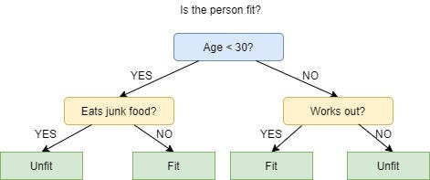
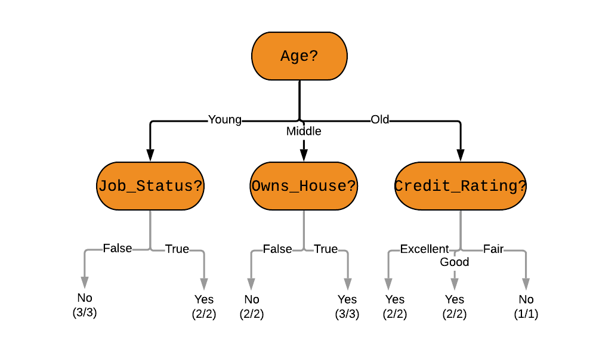

# ID3 and CART Algorithms

In the world of Decision Trees, **ID3** and **CART** are like two different master architects. They both want to build a "house" (the model), but they use different tools and blueprints to get there.

---

## 1. ID3 (Iterative Dichotomiser 3)
Developed in 1986, ID3 is the "original" algorithm that brought decision trees into the spotlight.

### **The "Multi-Way" Splitter**
Imagine you are splitting a dataset by the attribute **"Color"** which has three values: *Red, Blue, and Green*.
* **ID3's Approach:** It will immediately grow **three** branches.
* **The Logic:** ID3 believes that if an attribute has multiple categories, we should explore all of them simultaneously.

### **How ID3 Thinks (Step-by-Step)**
1. **Entropy Check:** It looks at the data and asks, "How messy is this?"
2. **Gain Calculation:** It calculates **Information Gain** for every attribute.
3. **The Winner:** The attribute that cleans up the "mess" (Entropy) the most becomes the next node.
4. **Repeat:** It keeps doing this until every branch leads to a "Pure" leaf (where all data belongs to one class).

**The Weakness:** ID3 is like a perfectionist who doesn't know when to stop. It often creates very deep, complex trees that work perfectly on training data but fail in the real world (Overfitting).



### **ID3 — Full Worked Example**

**Dataset:** Predict if a customer will buy a product.

| # | Age | Income | Student | Buys? |
|:---|:---|:---|:---|:---|
| 1 | Youth | High | No | No |
| 2 | Youth | High | No | No |
| 3 | Middle | High | No | Yes |
| 4 | Senior | Medium | No | Yes |
| 5 | Senior | Low | Yes | Yes |
| 6 | Senior | Low | Yes | No |
| 7 | Middle | Low | Yes | Yes |
| 8 | Youth | Medium | No | No |
| 9 | Youth | Low | Yes | Yes |
| 10 | Senior | Medium | Yes | Yes |

Total: 10 records. Buys=Yes → 6, Buys=No → 4.

**Step 1 — Total Entropy:**
$$Info(D) = -\frac{6}{10}\log_2\frac{6}{10} - \frac{4}{10}\log_2\frac{4}{10} \approx 0.971$$

**Step 2 — Information Gain per Attribute:**

| Attribute | $Info_A(D)$ | $Gain(A)$ |
|:---|:---|:---|
| Age | 0.693 | **0.278** ← Winner |
| Income | 0.888 | 0.083 |
| Student | 0.800 | 0.171 |

**Step 3 — Root Node = Age.** Three branches: Youth, Middle, Senior.
* Middle branch → all Yes → **Pure Leaf** (done).
* Youth and Senior branches → recurse using remaining attributes.

### **Limitations of ID3 in Detail**

| Limitation | Explanation |
|:---|:---|
| **No pruning** | Grows until all leaves are pure → overfits training data |
| **Categorical only** | Cannot directly handle numeric attributes like Age=25 |
| **No missing values** | Records with missing values must be discarded |
| **Gain bias** | Favors attributes with many unique values (e.g., ID columns) |
| **No backtracking** | Greedy choice at each step cannot be undone |

---

## 2. CART (Classification and Regression Trees)
Introduced in 1984, CART is the modern "powerhouse" used in almost all professional Data Science libraries (like Scikit-Learn).

### **The "Binary" Specialist**
CART is strictly binary. Even if the attribute **"Color"** has *Red, Blue, and Green*, CART will only split it into **two** branches at a time (e.g., "Is it Red?" vs. "Is it Not Red?").

### **How CART Thinks (Step-by-Step)**
1. **Gini Index:** Instead of Entropy, CART uses the **Gini Index** to measure "Impurity."
2. **Binary Search:** It tests every possible two-way split for every attribute.
3. **Regression Power:** Unlike ID3, if you want to predict a **Number** (like the price of a house), CART can do it using "Regression Trees."
4. **Pruning:** CART is smarter about stopping. It uses "Cost-Complexity Pruning" to snip off useless branches after the tree is built.



### **CART — Full Worked Example (Classification)**

Using the same 10-record dataset above.

**Step 1 — Parent Gini:**
$$Gini(D) = 1 - \left[\left(\frac{6}{10}\right)^2 + \left(\frac{4}{10}\right)^2\right] = 1 - [0.36 + 0.16] = 0.48$$

**Step 2 — Evaluate Binary Splits:**

**Attribute: Student (Yes / No)**
* Student=Yes: 4 records → Yes=3, No=1 → $Gini = 1-[(3/4)^2+(1/4)^2] = 0.375$
* Student=No: 6 records → Yes=3, No=3 → $Gini = 1-[(3/6)^2+(3/6)^2] = 0.500$
* $Gini_{Student}(D) = \frac{4}{10}(0.375) + \frac{6}{10}(0.500) = 0.450$
* $\Delta Gini = 0.48 - 0.450 = \mathbf{0.030}$

**Attribute: Age — split {Youth} vs {Middle, Senior}**
* Youth: 4 records → Yes=1, No=3 → $Gini = 0.375$
* Middle+Senior: 6 records → Yes=5, No=1 → $Gini \approx 0.278$
* $Gini_{Age}(D) = \frac{4}{10}(0.375) + \frac{6}{10}(0.278) = 0.317$
* $\Delta Gini = 0.48 - 0.317 = \mathbf{0.163}$ ← Best Split

**Step 3 — Root = Age split: {Youth} vs {Middle, Senior}.** Recurse on each side.

### **CART for Regression**
When the target is a continuous number (e.g., house price), CART switches its criterion from Gini to **Mean Squared Error (MSE)**:

$$MSE(S) = \frac{1}{|S|} \sum_{i \in S}(y_i - \bar{y})^2$$

The best split minimizes weighted MSE across both children:
$$Cost(split) = \frac{|S_L|}{|S|}MSE(S_L) + \frac{|S_R|}{|S|}MSE(S_R)$$

Each leaf predicts the **mean** of all training samples that fall into it.

### **Surrogate Splits — How CART Handles Missing Values**
When a record is missing a value for the chosen split attribute, CART uses a **surrogate split** — a backup attribute that best mimics how the primary attribute would have divided the data.

**Example:** Primary split is `Age ≤ 30`. If Age is missing for a record, CART looks for the next-best split (e.g., `Income ≤ Medium`) that produces the most similar partition, and uses that instead.

---

## 3. Key Technical Differences

| Feature | ID3 | CART |
| :--- | :--- | :--- |
| **Mathematical Brain** | Information Gain (Entropy) | Gini Index (Impurity) |
| **Branching Factor** | Multi-way (As many as you need) | Always Binary (Exactly 2) |
| **Handles Numbers?** | No (Categorical only) | Yes (Categorical & Continuous) |
| **Handles Missing Data?** | No | Yes (Uses "Surrogate Splits") |
| **Handles Regression?** | No | Yes (uses MSE) |
| **Pruning Strategy** | None (grows until pure) | Cost-Complexity Pruning |
| **Tree Depth** | Can be very deep | Controlled via pruning |
| **Bias** | Favors many-valued attributes | Favors larger partitions |
| **Best For...** | Simple, labeled datasets | Complex, real-world big data |
| **Used In** | Educational examples | Scikit-Learn, R, XGBoost |

---

## 4. Why "Greedy" Algorithms?
Students often see the term **"Greedy"** in textbooks. Here is what it actually means in this context:
* The algorithm looks for the **best split right now**.
* It does **not** look ahead to see if a different split now would make the tree better 5 steps later.
* It's like eating the best-looking piece of candy in a box immediately, rather than saving it for later.

### **Greedy vs. Optimal Search**

| Approach | Strategy | Tree Quality | Speed |
|:---|:---|:---|:---|
| **Greedy (ID3, CART)** | Best local split at each step | Good — not guaranteed optimal | Fast |
| **Optimal (exhaustive)** | Try all possible trees | Globally optimal | Exponentially slow |
| **Beam Search** | Keep top-$k$ candidates at each step | Better than greedy | Moderate |

> **Why Greedy is still used:** Finding the globally optimal decision tree is an NP-Hard problem. Greedy search gives "good enough" results in polynomial time, which is acceptable for real-world datasets.

---

## 5. The Splitting Mechanics: Multi-way vs. Binary

### **ID3 — Multi-Way Split**
```
         [ Outlook ]
        /     |     \
    Sunny  Overcast  Rain
     ...     Yes     ...
```
* One branch per unique value.
* **Pro:** Faster to reach pure leaves.
* **Con:** Attributes are "used up" quickly; can't reuse an attribute down the tree.

### **CART — Binary Split**
```
              [ Outlook ]
             /           \
        {Sunny}    {Overcast, Rain}
          ...            ...
                    [ Outlook ]
                   /           \
              {Overcast}       {Rain}
                Yes             ...
```
* Any categorical value can be isolated against the rest.
* **Pro:** Attributes can be revisited at different levels of the tree.
* **Con:** Requires more levels to express what ID3 does in one step.

---

## 6. Cost-Complexity Pruning (CART's Secret Weapon)

CART grows a full tree $T_0$ first, then **prunes** it back using the cost-complexity criterion:

$$R_\alpha(T) = R(T) + \alpha \cdot |T|$$

Where:
* $R(T)$ = misclassification rate on training data
* $|T|$ = number of leaf nodes (tree complexity)
* $\alpha$ = complexity parameter (penalty per leaf)

**The Pruning Process:**
1. Start with the full tree $T_0$.
2. For each internal node, compute the weakest link — the node whose removal causes the smallest increase in $R(T)$.
3. Remove it, producing a simpler tree $T_1$.
4. Repeat until only the root remains, producing a sequence: $T_0 \supset T_1 \supset T_2 \supset \ldots$
5. Use **cross-validation** to find the $\alpha$ that minimizes test error.

**Effect of $\alpha$:**

| $\alpha$ value | Tree Behavior |
|:---|:---|
| $\alpha = 0$ | No penalty → full tree (overfits) |
| Small $\alpha$ | Slightly pruned → mild regularization |
| Large $\alpha$ | Heavily pruned → may underfit |
| $\alpha = \infty$ | Single root node only |

---

## 7. Summary of Stopping Conditions
A student must know when these algorithms decide to stop growing a branch:
1. **Pure Node:** Every record in the branch belongs to the same class (e.g., all are "Spam").
2. **No Attributes Left:** There are no more questions left to ask.
3. **Threshold Reached:** The "Gain" from the next split is too small to be worth the effort.
4. **Empty Subset:** There are no more data points to classify in that branch.


### **Additional Pre-Pruning Stops (CART)**

| Condition | Parameter (sklearn) | Default |
|:---|:---|:---|
| Max tree depth | `max_depth` | None (unlimited) |
| Min samples to split | `min_samples_split` | 2 |
| Min samples in leaf | `min_samples_leaf` | 1 |
| Min impurity decrease | `min_impurity_decrease` | 0.0 |
| Max leaf nodes | `max_leaf_nodes` | None |

---

## 8. Common Confusion: Which one is "Better"?
There is no "perfect" algorithm, but:
* **CART** is generally preferred in modern industries because it handles numbers and is less likely to overfit due to its pruning logic.
* **ID3** is excellent for learning the fundamentals of Information Theory and works well for small, purely categorical datasets.

### **Decision Guide**

```
Is your target variable continuous (a number)?
    → YES → Use CART (Regression Tree)
    → NO  → Does your data have missing values?
                → YES → Use CART (surrogate splits)
                → NO  → Do any attributes have many unique values?
                            → YES → Use C4.5 (Gain Ratio corrects bias)
                            → NO  → Either works; use ID3 for simplicity
                                    or CART for binary structure
```

---

## 9. Python Implementation: ID3 vs. CART Side-by-Side

```python
from sklearn.tree import DecisionTreeClassifier
from sklearn.metrics import accuracy_score

# --- ID3-style (Information Gain / Entropy, no depth limit) ---
id3_clf = DecisionTreeClassifier(
    criterion='entropy',      # Entropy = ID3's Information Gain
    splitter='best',
    max_depth=None,           # ID3 grows until pure (no pruning)
    random_state=42
)
id3_clf.fit(X_train, y_train)

# --- CART-style (Gini Index, with cost-complexity pruning) ---
cart_clf = DecisionTreeClassifier(
    criterion='gini',         # Gini = CART's default
    splitter='best',
    max_depth=None,           # Let it grow; prune afterwards
    ccp_alpha=0.01,           # Cost-complexity pruning parameter
    random_state=42
)
cart_clf.fit(X_train, y_train)

# --- Compare ---
print(f"ID3  Accuracy: {accuracy_score(y_test, id3_clf.predict(X_test)):.4f}")
print(f"CART Accuracy: {accuracy_score(y_test, cart_clf.predict(X_test)):.4f}")
print(f"ID3  Tree depth:  {id3_clf.get_depth()}")
print(f"CART Tree depth:  {cart_clf.get_depth()}")
print(f"ID3  Leaf nodes:  {id3_clf.get_n_leaves()}")
print(f"CART Leaf nodes:  {cart_clf.get_n_leaves()}")

# --- Find optimal ccp_alpha via cross-validation ---
from sklearn.model_selection import cross_val_score
import numpy as np

path = cart_clf.cost_complexity_pruning_path(X_train, y_train)
alphas = path.ccp_alphas

cv_scores = [cross_val_score(
    DecisionTreeClassifier(criterion='gini', ccp_alpha=a, random_state=42),
    X_train, y_train, cv=5
).mean() for a in alphas]

best_alpha = alphas[np.argmax(cv_scores)]
print(f"Best alpha: {best_alpha:.4f}")
```

---

## 10. Quick Summary Table

| Property | ID3 | CART |
|:---|:---|:---|
| Year | 1986 | 1984 |
| Author | Ross Quinlan | Breiman, Friedman, Olshen, Stone |
| Criterion | Information Gain | Gini Index / MSE |
| Split type | Multi-way | Binary only |
| Pruning | None | Cost-Complexity (post-pruning) |
| Missing values | ✗ | ✓ (surrogates) |
| Continuous features | ✗ | ✓ |
| Regression | ✗ | ✓ |
| Still in use | Mostly academic | Industry standard (sklearn, XGBoost) |