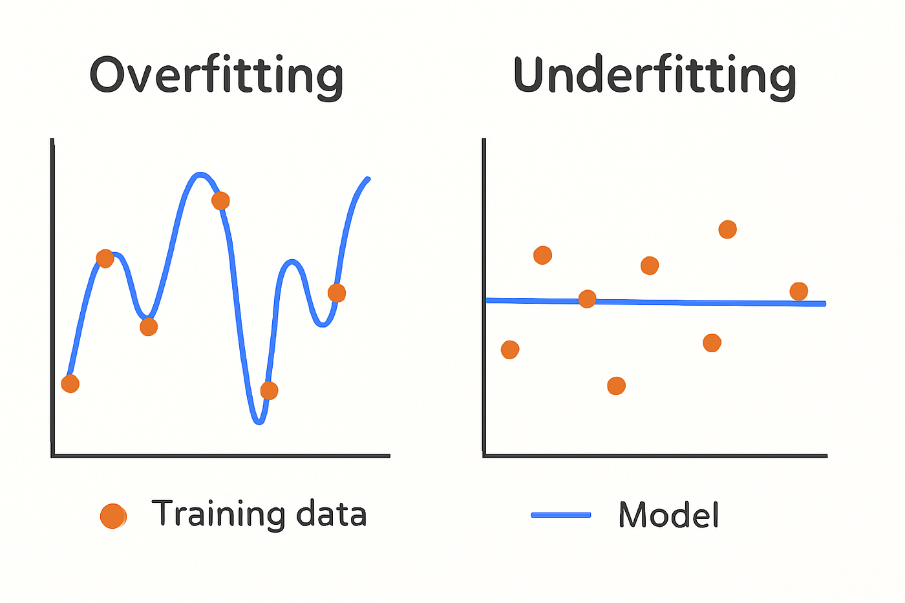

# Tree Pruning

In machine learning, "bigger is not always better." While a fully grown decision tree can achieve 100% accuracy on training data, it often fails miserably on new data because it has captured the **noise** (random fluctuations) instead of the **signal** (the actual pattern). **Tree Pruning** is the essential process of simplifying a tree to make it "smarter" and more robust.

---

## 1. The Core Conflict: Overfitting vs. Underfitting
Pruning is the act of finding the "Sweet Spot" in the complexity of a model.

* **No Pruning (Overfitting):** The tree is too deep. It has a branch for every single outlier. It "memorizes" the past but cannot predict the future.
* **Too Much Pruning (Underfitting):** The tree is too shallow. It misses important patterns and is too simple to be useful.
* **Optimal Tree (Pruned):** The tree is just deep enough to capture the general rules while ignoring the random noise.



### **The Bias-Variance Tradeoff**
Pruning is fundamentally about managing the **Bias-Variance Tradeoff**:

| Model | Bias | Variance | Result |
|:---|:---|:---|:---|
| Unpruned (Deep) Tree | Low | **High** | Overfits training data |
| Over-pruned (Shallow) Tree | **High** | Low | Underfits; misses patterns |
| Well-pruned Tree | Balanced | Balanced | Generalizes to new data |

$$\text{Total Error} = \text{Bias}^2 + \text{Variance} + \text{Irreducible Noise}$$

> **Key Insight:** You cannot eliminate both bias and variance simultaneously. Pruning trades a small increase in bias for a much larger decrease in variance, resulting in lower total error.

---

## 2. Pre-Pruning: The "Preventative" Approach
Pre-pruning acts like a set of rules that stop the tree-building process before it goes too far. This is a **Top-Down** approach.

### **Common Stopping Thresholds:**
1.  **Maximum Depth:** Limits how many "levels" the tree can have.
2.  **Minimum Samples per Leaf:** Ensures that a final decision (leaf) is based on a significant number of data points (e.g., "Don't make a decision based on just 2 people").
3.  **Minimum Impurity Decrease:** Only split a node if it improves the "purity" (Gini/Entropy) by a significant amount (e.g., > 0.05).
4.  **Max Features:** Limits the number of attributes the tree can consider at each split.

**The Risk:** Pre-pruning can suffer from the **"Horizon Effect."** It might stop a split that looks bad now, but that split could have led to a very important discovery 2 levels deeper.

### **The Horizon Effect — Illustrated**

```
Node A: Gain = 0.02  ← Pre-pruning STOPS here (gain too small)
   └── Node B: Gain = 0.35  ← This critical split is NEVER reached!
          ├── Leaf: Class=YES (95% pure)
          └── Leaf: Class=NO  (92% pure)
```

By stopping at Node A, the algorithm misses Node B — a highly informative split hidden one level deeper. Post-pruning avoids this by always exploring first.

### **Pre-Pruning Parameters (scikit-learn)**

| Parameter | What It Controls | Effect if Too Small | Effect if Too Large |
|:---|:---|:---|:---|
| `max_depth` | Max levels in the tree | Underfitting | Overfitting |
| `min_samples_split` | Min samples needed to split a node | Overfitting | Underfitting |
| `min_samples_leaf` | Min samples required in a leaf | Overfitting | Underfitting |
| `min_impurity_decrease` | Min gain threshold to allow a split | Overfitting | Underfitting |
| `max_leaf_nodes` | Max total leaf nodes in the tree | Underfitting | Overfitting |
| `max_features` | Features considered at each split | Underfitting | Overfitting |

---

## 3. Post-Pruning: The "Curative" Approach
Post-pruning is a **Bottom-Up** approach. It is generally more successful because it looks at the whole tree before making cuts.

### **Cost-Complexity Pruning (The CART Logic)**
This is the most famous mathematical method for pruning. It uses a parameter called **Alpha ($\alpha$)**.

The goal is to minimize the following "Cost" function:
$$R_\alpha(T) = R(T) + \alpha|T|$$

* **$R(T)$:** The misclassification error of the tree.
* **$|T|$:** The number of terminal nodes (leaves).
* **$\alpha$:** The complexity parameter.
    * If $\alpha$ is 0, the tree stays large.
    * As $\alpha$ increases, the "penalty" for having more leaves grows, forcing the tree to become smaller.


### **Finding the Optimal Alpha**

The optimal $\alpha$ is found using **cross-validation**:

1. Grow the full tree $T_0$ on training data.
2. Generate a sequence of progressively pruned trees: $T_0 \supset T_1 \supset T_2 \supset \ldots \supset T_{\text{root}}$ by increasing $\alpha$.
3. Evaluate each tree on a **validation set** (or via k-fold cross-validation).
4. Choose the $\alpha$ that gives the **lowest validation error**.

**$\alpha$ Effect Summary:**

| $\alpha$ | Penalty | Tree Size | Risk |
|:---|:---|:---|:---|
| 0 | None | Full tree | Overfitting |
| Small | Mild | Slightly pruned | Balanced |
| Medium | Moderate | Significantly pruned | Optimal zone |
| Large | Severe | Very shallow | Underfitting |
| $\infty$ | Maximum | Root only | Useless |

---

## 4. Pruning Techniques: A Closer Look

### **A. Reduced Error Pruning (REP)**
1.  Divide your data into a **Training Set** and a **Validation Set**.
2.  Grow the tree fully using the Training Set.
3.  For every internal node, temporarily replace it with a leaf and check the accuracy on the **Validation Set**.
4.  If the accuracy stays the same or improves, **cut the branch permanently.**
5.  Repeat until no more cuts improve the accuracy.

**Strengths of REP:**
* Simple and fast to implement.
* Guaranteed not to decrease validation accuracy.

**Weaknesses of REP:**
* Requires a separate validation set → less data for training.
* May over-prune when the validation set is small or unrepresentative.

### **B. Rule Post-Pruning**
1.  Convert the tree into a set of **IF-THEN rules**.
2.  Each path from the root to a leaf becomes one rule.
3.  Analyze each rule and remove any "IF" conditions that don't help accuracy.
4.  Sort the simplified rules by accuracy and use them for classification.

**Example — Converting a tree path to a rule:**

```
Tree Path:
  [Outlook = Sunny] → [Humidity = High] → Leaf: NO

Equivalent Rule:
  IF Outlook = Sunny AND Humidity = High THEN Class = NO

After Rule Pruning (if Outlook alone is sufficient):
  IF Outlook = Sunny THEN Class = NO
```

**Advantage over REP:** Rules can be pruned **independently** of each other. A condition that is useful in one rule can be removed from another without affecting the first.

### **C. Minimum Description Length (MDL) Pruning**
Based on information theory — the best model is the one that minimizes the total "description length" of both the model and the data:
$$MDL = L(T) + L(D|T)$$

* $L(T)$ = bits needed to describe the tree structure.
* $L(D|T)$ = bits needed to describe misclassified records given the tree.

A subtree is pruned if the pruned version has a shorter total description length. This is a principled, parameter-free approach.

### **D. Pessimistic Pruning (C4.5 Method)**
C4.5 uses an optimistic estimate of training accuracy and corrects it with a **continuity correction** to get a more realistic (pessimistic) estimate:

$$e_{pessimistic}(t) = \frac{E(t) + z^2/2 + z\sqrt{E(t)(1 - E(t)/N) + z^2/4}}{N + z^2}$$

Where $E(t)$ = errors at node $t$, $N$ = samples at node $t$, and $z$ = confidence level (typically 1.96 for 95%).

If the pessimistic error of a subtree is **greater than** that of replacing it with a leaf, the subtree is pruned.

**Key advantage:** Does **not** require a separate validation set — the pruning decision is made using training data alone with a statistical correction.


---

## 5. Comparison: Why Post-Pruning is Often Better

| Feature | Pre-Pruning | Post-Pruning |
| :--- | :--- | :--- |
| **Strategy** | Stop early. | Grow full, then cut. |
| **Visibility** | Limited (cannot see future splits). | Full (sees the entire tree structure). |
| **Computation** | Very fast and efficient. | Slower (requires building the full tree). |
| **Accuracy** | Risk of "Underfitting." | Usually higher accuracy and better generalization. |
| **Horizon Effect** | Susceptible | Immune |
| **Data Required** | Training set only | Training + Validation set (REP) |
| **Standard Use** | Real-time / Large datasets. | High-precision scientific models. |

---

## 6. Pruning in Practice: Step-by-Step with scikit-learn

```python
from sklearn.tree import DecisionTreeClassifier
from sklearn.model_selection import train_test_split, cross_val_score
from sklearn.metrics import accuracy_score
import matplotlib.pyplot as plt
import numpy as np

X_train, X_test, y_train, y_test = train_test_split(X, y, test_size=0.2, random_state=42)

# --- Step 1: Grow the full unpruned tree ---
full_tree = DecisionTreeClassifier(random_state=42)
full_tree.fit(X_train, y_train)
print(f"Full Tree — Depth: {full_tree.get_depth()}, Leaves: {full_tree.get_n_leaves()}")
print(f"Full Tree — Train Acc: {accuracy_score(y_train, full_tree.predict(X_train)):.4f}")
print(f"Full Tree — Test  Acc: {accuracy_score(y_test,  full_tree.predict(X_test)):.4f}")

# --- Step 2: Find candidate alpha values ---
path = full_tree.cost_complexity_pruning_path(X_train, y_train)
ccp_alphas = path.ccp_alphas[:-1]  # Remove the last (trivial) alpha

# --- Step 3: Train a tree for each alpha ---
trees = []
for alpha in ccp_alphas:
    clf = DecisionTreeClassifier(ccp_alpha=alpha, random_state=42)
    clf.fit(X_train, y_train)
    trees.append(clf)

# --- Step 4: Evaluate each tree ---
train_scores = [accuracy_score(y_train, t.predict(X_train)) for t in trees]
test_scores  = [accuracy_score(y_test,  t.predict(X_test))  for t in trees]

# --- Step 5: Plot accuracy vs. alpha ---
plt.figure(figsize=(10, 5))
plt.plot(ccp_alphas, train_scores, marker='o', label='Train Accuracy', color='blue')
plt.plot(ccp_alphas, test_scores,  marker='o', label='Test Accuracy',  color='orange')
plt.xlabel("Alpha (Complexity Parameter)")
plt.ylabel("Accuracy")
plt.title("Accuracy vs. Alpha for Cost-Complexity Pruning")
plt.legend()
plt.grid(True)
plt.tight_layout()
plt.savefig("pruning_curve.png", dpi=150)
plt.show()

# --- Step 6: Pick the best alpha ---
best_idx   = np.argmax(test_scores)
best_alpha = ccp_alphas[best_idx]
best_tree  = trees[best_idx]
print(f"\nBest Alpha: {best_alpha:.5f}")
print(f"Best Tree  — Depth: {best_tree.get_depth()}, Leaves: {best_tree.get_n_leaves()}")
print(f"Best Tree  — Test Acc: {test_scores[best_idx]:.4f}")
```

---

## 7. Visualizing the Effect of Pruning

```python
from sklearn.tree import plot_tree

fig, axes = plt.subplots(1, 2, figsize=(20, 8))

# Unpruned tree
plot_tree(full_tree, max_depth=3, filled=True,
          feature_names=feature_names, class_names=class_names, ax=axes[0])
axes[0].set_title(f"BEFORE Pruning (depth={full_tree.get_depth()})", fontsize=14)

# Pruned tree
plot_tree(best_tree, filled=True,
          feature_names=feature_names, class_names=class_names, ax=axes[1])
axes[1].set_title(f"AFTER Pruning (depth={best_tree.get_depth()}, α={best_alpha:.4f})", fontsize=14)

plt.tight_layout()
plt.savefig("before_after_pruning.png", dpi=150)
plt.show()
```

---

## 8. How to Explain Pruning in Exams
When asked about Pruning, focus on these three keywords:
1.  **Complexity:** Reducing the number of nodes.
2.  **Generalization:** Improving performance on new, unseen data.
3.  **Noise:** Removing branches that were created due to errors or outliers in the training set.


### **Exam-Ready Definitions**

| Term | One-Line Definition |
|:---|:---|
| **Pruning** | Removing branches of a decision tree that provide little predictive power to reduce overfitting |
| **Pre-pruning** | Stopping tree growth early by applying constraints during the induction process |
| **Post-pruning** | Growing the full tree first, then removing subtrees that do not improve validation accuracy |
| **Overfitting** | When a model memorizes training noise and performs poorly on unseen data |
| **Underfitting** | When a model is too simple to capture the true pattern in the data |
| **Alpha ($\alpha$)** | The complexity penalty parameter in cost-complexity pruning; higher $\alpha$ = simpler tree |
| **Horizon Effect** | The failure of pre-pruning to explore splits that look poor now but lead to good splits later |
| **Validation Set** | A held-out subset of data used to evaluate pruning decisions without touching the test set |

---

### **Summary Table**
| If the tree is... | Problem | Action |
| :--- | :--- | :--- |
| Too Deep | Overfitting | Apply Post-Pruning (or reduce `max_depth`) |
| Too Shallow | Underfitting | Reduce Pruning constraints (lower `min_samples_leaf`) |
| Perfect | Balanced | Model generalizes well — validate on held-out test set |
| Unknown | Unclear | Use cross-validation to measure true generalization error |