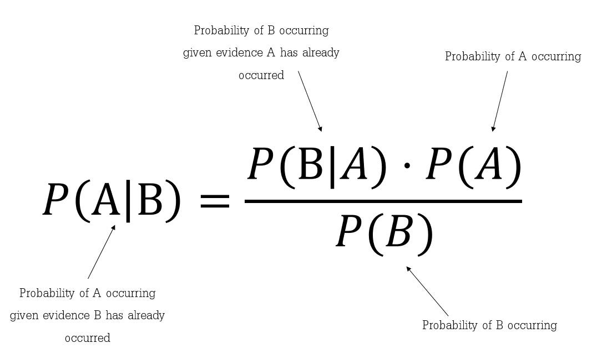

# Bayes Classification Methods

Bayesian classification is a probabilistic approach to machine learning based on **Bayes' Theorem**. Unlike Decision Trees which use "If-Then" logic, Bayesian classifiers use statistical probability to ask: *"Given the evidence we see, what is the most likely category for this data point?"*

---

## 1. The Foundation: Bayes' Theorem
Bayes' Theorem is a mathematical formula used to determine the probability of a hypothesis ($H$) based on prior knowledge and new evidence ($X$).

### **The Formula**
$$P(H|X) = \frac{P(X|H) \cdot P(H)}{P(X)}$$

**Understanding the components:**
* **$P(H|X)$ (Posterior Probability):** The probability that hypothesis $H$ is true given evidence $X$. (e.g., *Probability it is Spam given the word "Winner" is present*).
* **$P(X|H)$ (Likelihood):** The probability of seeing the evidence $X$ if the hypothesis $H$ were true. (e.g., *How often does the word "Winner" appear in known Spam?*).
* **$P(H)$ (Prior Probability):** The original probability of the hypothesis before looking at evidence. (e.g., *In general, what percentage of my emails are Spam?*).
* **$P(X)$ (Evidence Probability):** The total probability of the evidence occurring across all classes.



### **Intuitive Analogy**
Think of Bayes' Theorem as a doctor updating their diagnosis:
* **Prior** $P(H)$: "5% of patients who visit with this symptom have disease X."
* **Likelihood** $P(X|H)$: "90% of patients with disease X test positive."
* **Posterior** $P(H|X)$: "Given this positive test, what is the updated probability of disease X?"

The posterior is always a **refinement** of the prior based on new evidence.

### **Expanding $P(X)$ — The Total Probability**
$P(X)$ can be expanded as the sum over all possible classes:
$$P(X) = \sum_{i=1}^{k} P(X | C_i) \cdot P(C_i)$$

This ensures all posterior probabilities sum to 1 across all classes.

---

## 2. Naive Bayesian Classification
In real-world data mining, we usually have many attributes (Age, Income, Location, etc.). Calculating the exact probability for all combinations is computationally expensive. To solve this, we use the **Naive Bayesian Classifier**.

### **The "Naive" Assumption**
It is called **"Naive"** because it makes a strong assumption: **Class Conditional Independence.**
> **The Logic:** It assumes that the effect of an attribute on a class is independent of other attributes. For example, it assumes "Age" has nothing to do with "Income" when predicting a class.

Even though attributes are often related in real life, this "Naive" approach makes the math much faster and results in surprisingly high accuracy for large datasets.

### **Why Independence Matters Computationally**

Without the independence assumption, for $n$ binary features we would need to estimate:
$$2^n - 1 \text{ parameters per class}$$

With independence, we only need:
$$n \text{ parameters per class}$$

**Example:** With just 30 binary features, this reduces from over **1 billion** parameters to just **30**. That is the power of the Naive assumption.

---

## 3. Mathematical Mechanics of Naive Bayes
To classify a tuple $X = (x_1, x_2, \dots, x_n)$, the classifier predicts that $X$ belongs to the class $C_i$ having the highest posterior probability.

Since $P(X)$ is constant for all classes, we only need to maximize the numerator:
$$P(X|C_i) \cdot P(C_i)$$

Using the independence assumption, the likelihood is calculated as the product of individual probabilities:
$$P(X|C_i) = P(x_1|C_i) \times P(x_2|C_i) \times \dots \times P(x_n|C_i)$$


### **The MAP Decision Rule**
The final classification uses the **Maximum A Posteriori (MAP)** rule:
$$\hat{C} = \arg\max_{C_i} P(C_i | X) = \arg\max_{C_i} P(C_i) \prod_{j=1}^{n} P(x_j | C_i)$$

### **Log-Space Trick**
In practice, multiplying many small probabilities causes **numerical underflow** (the number becomes too small for computers to represent). The solution is to work in **log space**:
$$\hat{C} = \arg\max_{C_i} \left[ \log P(C_i) + \sum_{j=1}^{n} \log P(x_j | C_i) \right]$$

Since $\log$ is a monotonically increasing function, the class with the highest log-probability is the same as the class with the highest probability. This converts multiplication into addition, making computation numerically stable.

---

## 4. Types of Naive Bayes Models
Depending on the distribution of your data, you choose different versions:

### **A. Gaussian Naive Bayes**
Used when features are **continuous** (like temperature or height). It assumes the data follows a **Normal (Gaussian) Distribution**.

$$P(x_j | C_i) = \frac{1}{\sqrt{2\pi\sigma_{ij}^2}} \exp\left(-\frac{(x_j - \mu_{ij})^2}{2\sigma_{ij}^2}\right)$$

Where $\mu_{ij}$ and $\sigma_{ij}^2$ are the mean and variance of feature $j$ for class $C_i$ estimated from training data.

**Best for:** Sensor readings, medical measurements, financial data.

### **B. Multinomial Naive Bayes**
Used for **discrete counts**. The "Go-to" model for **Text Classification** (word counts in documents).

$$P(x_j | C_i) = \frac{\text{count}(x_j, C_i) + \alpha}{\sum_k \text{count}(x_k, C_i) + \alpha \cdot |V|}$$

Where $|V|$ is the vocabulary size and $\alpha$ is the Laplace smoothing parameter.

**Best for:** Document classification, spam filtering, topic modelling.

### **C. Bernoulli Naive Bayes**
Used when features are **binary** (Yes/No, 0/1). It only cares if a feature is *present* or *absent*, not how many times it appears.

$$P(x_j | C_i) = P(j | C_i)^{x_j} \cdot (1 - P(j | C_i))^{1-x_j}$$

**Key difference from Multinomial:** Bernoulli explicitly penalises the **absence** of a feature, while Multinomial ignores absent features entirely.

**Best for:** Short text classification, binary feature datasets.

### **Comparison of Naive Bayes Variants**

| Type | Feature Type | Key Formula | Best Used For |
|:---|:---|:---|:---|
| **Gaussian** | Continuous | Normal distribution | Medical data, sensor readings |
| **Multinomial** | Discrete counts | Word frequency | Document/spam classification |
| **Bernoulli** | Binary (0/1) | Presence/absence | Short texts, binary datasets |

---

## 5. The Zero-Probability Problem (Laplacian Correction)
Suppose you are building a spam filter. If the word "Jackpot" never appeared in your "Safe Email" training set, the probability $P(\text{'Jackpot'} | \text{Safe})$ becomes **0**.
* Because we multiply probabilities, $0 \times \text{everything else} = 0$.
* One single missing value would ruin the entire prediction.

**The Solution: Laplacian Correction (Smoothing)**
We add a small value (usually $1$) to the count of every attribute value.
$$P(x_k|C_i) = \frac{\text{count}(x_k, C_i) + 1}{\text{count}(C_i) + \text{number of unique values}}$$

This ensures that no probability ever hits exactly zero.

### **Generalised Smoothing Parameter $\alpha$**

The correction generalises to any smoothing strength $\alpha$:
$$P(x_k|C_i) = \frac{\text{count}(x_k, C_i) + \alpha}{\text{count}(C_i) + \alpha \cdot k}$$

Where $k$ = number of unique values for that feature.

| $\alpha$ value | Name | Effect |
|:---|:---|:---|
| $\alpha = 0$ | No smoothing | Zero-probability problem remains |
| $\alpha = 1$ | Laplace smoothing | Standard correction, uniform prior |
| $0 < \alpha < 1$ | Lidstone smoothing | Softer correction for large vocabularies |

### **Worked Example of Laplace Smoothing**

Training data for "Safe Email": 100 emails, word "Jackpot" appears 0 times.

| | Without Smoothing | With Laplace ($\alpha=1$) |
|:---|:---|:---|
| $P(\text{Jackpot} \| \text{Safe})$ | $0/100 = \mathbf{0}$ ← breaks everything | $(0+1)/(100+2) \approx \mathbf{0.0098}$ |
| $P(\text{Jackpot} \| \text{Spam})$ | $30/80 = 0.375$ | $(30+1)/(80+2) \approx 0.378$ |

(Assumes vocabulary has 2 unique values for this feature.)

---

## 6. Full Worked Example: Play Tennis

**Dataset:** 14 records. Target: Play? (Yes=9, No=5)

| Day | Outlook | Temp | Humidity | Wind | Play? |
|:---|:---|:---|:---|:---|:---|
| D1 | Sunny | Hot | High | Weak | No |
| D2 | Sunny | Hot | High | Strong | No |
| D3 | Overcast | Hot | High | Weak | Yes |
| D4 | Rain | Mild | High | Weak | Yes |
| D5 | Rain | Cool | Normal | Weak | Yes |
| D6 | Rain | Cool | Normal | Strong | No |
| D7 | Overcast | Cool | Normal | Strong | Yes |
| D8 | Sunny | Mild | High | Weak | No |
| D9 | Sunny | Cool | Normal | Weak | Yes |
| D10 | Rain | Mild | Normal | Weak | Yes |
| D11 | Sunny | Mild | Normal | Strong | Yes |
| D12 | Overcast | Mild | High | Strong | Yes |
| D13 | Overcast | Hot | Normal | Weak | Yes |
| D14 | Rain | Mild | High | Strong | No |

**Test Sample $X$:** {Outlook=Sunny, Temp=Cool, Humidity=High, Wind=Strong}

### **Step 1: Prior Probabilities**
$$P(\text{Yes}) = \frac{9}{14} \approx 0.643 \qquad P(\text{No}) = \frac{5}{14} \approx 0.357$$

### **Step 2: Likelihoods from Training Data**

**For class = Yes (9 records):**

| Attribute | Value | Count | $P(x|Yes)$ |
|:---|:---|:---|:---|
| Outlook | Sunny | 2 | 2/9 ≈ 0.222 |
| Temp | Cool | 3 | 3/9 ≈ 0.333 |
| Humidity | High | 3 | 3/9 ≈ 0.333 |
| Wind | Strong | 3 | 3/9 ≈ 0.333 |

**For class = No (5 records):**

| Attribute | Value | Count | $P(x|No)$ |
|:---|:---|:---|:---|
| Outlook | Sunny | 3 | 3/5 = 0.600 |
| Temp | Cool | 1 | 1/5 = 0.200 |
| Humidity | High | 4 | 4/5 = 0.800 |
| Wind | Strong | 3 | 3/5 = 0.600 |

### **Step 3: Compute Unnormalised Posteriors**

$$P(\text{Yes}|X) \propto 0.643 \times 0.222 \times 0.333 \times 0.333 \times 0.333 \approx \mathbf{0.00528}$$

$$P(\text{No}|X) \propto 0.357 \times 0.600 \times 0.200 \times 0.800 \times 0.600 \approx \mathbf{0.02058}$$

### **Step 4: Normalise**
$$P(\text{Yes}|X) = \frac{0.00528}{0.00528 + 0.02058} \approx \mathbf{0.204}$$
$$P(\text{No}|X) = \frac{0.02058}{0.00528 + 0.02058} \approx \mathbf{0.796}$$

**Decision:** Classify as **No** — on a Sunny, Cool, Humid, Windy day, don't play tennis.

---

## 7. Comparison: Decision Trees vs. Naive Bayes

| Feature | Decision Trees | Naive Bayes |
| :--- | :--- | :--- |
| **Model Type** | Descriptive (If-Then rules) | Probabilistic (Mathematical) |
| **Speed** | Medium (Building trees is complex) | Fast (Simple arithmetic) |
| **Missing Values** | Handled by branches | Naturally ignored in products |
| **Correlation** | Handles dependent features well | Struggles if features are highly correlated |
| **Interpretability** | High (visual tree) | Medium (formula-based) |
| **Small Data** | Can overfit | Works well (fewer parameters) |
| **Text Classification** | Poor | Excellent (Multinomial NB) |
| **Output** | Hard class label | Probability distribution over classes |


---

## 8. When Naive Bayes Fails
Despite its strengths, the Naive assumption breaks down in certain scenarios:

| Failure Scenario | Example | Effect |
|:---|:---|:---|
| **Correlated features** | `Height` and `Weight` are related | Double-counts evidence; distorts probabilities |
| **Feature interactions** | XOR problem: class = A XOR B | Independence assumption cannot capture joint effects |
| **Very small training data** | 2 training samples per class | Probabilities are unreliable estimates |
| **Continuous data not Gaussian** | Bimodal or skewed distribution | Gaussian NB gives poor probability estimates |

**Practical fix:** When features are correlated, consider **feature selection** (remove redundant features) or switch to a model that handles correlation (e.g., Logistic Regression, SVM).

---

## 9. Real-World Applications
1.  **Email Spam Filtering:** Ranking emails based on word frequencies.
2.  **Sentiment Analysis:** Identifying if a social media post is "Positive" or "Negative."
3.  **Recommendation Systems:** Predicting if a user will like a movie based on their history.
4.  **Real-time Prediction:** Since it's so fast, it's used for instant results in online ads.
5.  **Medical Diagnosis:** Computing the probability of a disease given a set of test results.
6.  **News Categorisation:** Automatically tagging articles as Sports, Politics, Tech, etc.
7.  **Intrusion Detection:** Flagging unusual network activity in cybersecurity systems.

---

## 10. Python Implementation

```python
from sklearn.naive_bayes import GaussianNB, MultinomialNB, BernoulliNB
from sklearn.model_selection import train_test_split, cross_val_score
from sklearn.metrics import accuracy_score, classification_report
from sklearn.preprocessing import LabelEncoder
import numpy as np

X_train, X_test, y_train, y_test = train_test_split(X, y, test_size=0.2, random_state=42)

# --- Gaussian Naive Bayes (continuous features) ---
gnb = GaussianNB()
gnb.fit(X_train, y_train)
print("Gaussian NB Accuracy:", accuracy_score(y_test, gnb.predict(X_test)))

# --- Multinomial Naive Bayes (word counts / discrete) ---
mnb = MultinomialNB(alpha=1.0)   # alpha=1 is Laplace smoothing
mnb.fit(X_train, y_train)
print("Multinomial NB Accuracy:", accuracy_score(y_test, mnb.predict(X_test)))

# --- Bernoulli Naive Bayes (binary features) ---
bnb = BernoulliNB(alpha=1.0)
bnb.fit(X_train, y_train)
print("Bernoulli NB Accuracy:", accuracy_score(y_test, bnb.predict(X_test)))

# --- Cross-validation ---
for name, clf in [("Gaussian", gnb), ("Multinomial", mnb), ("Bernoulli", bnb)]:
    scores = cross_val_score(clf, X, y, cv=5, scoring='accuracy')
    print(f"{name} NB — CV Accuracy: {scores.mean():.4f} ± {scores.std():.4f}")

# --- Get probability estimates (not just hard labels) ---
proba = gnb.predict_proba(X_test)   # shape: (n_samples, n_classes)
print("Class probabilities for first test sample:", proba[0])
```

---

# Algorithm: Bayesian Classification (Naïve Bayes)

Naïve Bayes is a probabilistic classifier based on Bayes' Theorem with the "naïve" assumption of conditional independence between every pair of features given the class variable.

---

## 1. Basic Working Steps
1.  **Calculate Prior Probability:** Determine the probability of each class occurring in the training set $P(C_i)$.
2.  **Calculate Likelihood:** For each attribute value $x_j$ in the input vector $X$, calculate the conditional probability $P(x_j | C_i)$ for each class.
3.  **Calculate Posterior Probability:** Use Bayes' Theorem to find $P(C_i | X)$, which is the probability that the given input belongs to class $C_i$.
4.  **Classify:** Assign the input $X$ to the class with the **highest posterior probability** (Maximum A Posteriori).

---

## 2. Key Formulas

### **A. Bayes' Theorem**
$$P(C_i | X) = \frac{P(X | C_i) \cdot P(C_i)}{P(X)}$$
* Since $P(X)$ is constant for all classes, we only need to maximize the numerator: $P(X | C_i) \cdot P(C_i)$.

### **B. Naïve Independence Assumption**
If $X$ has multiple attributes $(x_1, x_2, \dots, x_n)$, then:
$$P(X | C_i) = \prod_{j=1}^{n} P(x_j | C_i)$$

### **C. MAP Decision Rule**
$$\hat{C} = \arg\max_{C_i} \left[ P(C_i) \prod_{j=1}^{n} P(x_j | C_i) \right]$$

### **D. Gaussian Likelihood (for continuous features)**
$$P(x_j | C_i) = \frac{1}{\sqrt{2\pi\sigma_{ij}^2}} \exp\left(-\frac{(x_j - \mu_{ij})^2}{2\sigma_{ij}^2}\right)$$

### **E. Laplace Smoothing**
$$P(x_k | C_i) = \frac{\text{count}(x_k, C_i) + \alpha}{\text{count}(C_i) + \alpha \cdot k}$$


---

## 3. Practical Example

**Dataset: Predict if a "Fruit" is an "Orange" based on "Shape" (Round) and "Color" (Orange).**

| Fruit Type ($C_i$) | Shape ($x_1$) | Color ($x_2$) |
| :--- | :--- | :--- |
| Orange | Round | Orange |
| Orange | Round | Orange |
| Apple | Round | Red |
| Grape | Round | Green |

**Test Data ($X$):** {Shape = Round, Color = Orange}

### **Step 1: Prior Probabilities $P(C_i)$**
* $P(\text{Orange}) = 2/4 = 0.5$
* $P(\text{Apple}) = 1/4 = 0.25$
* $P(\text{Grape}) = 1/4 = 0.25$

### **Step 2: Likelihoods $P(X | C_i)$**
* **For Orange:** $P(\text{Round} | \text{Orange}) = 2/2 = 1.0$; $P(\text{Orange} | \text{Orange}) = 2/2 = 1.0$
* **For Apple:** $P(\text{Round} | \text{Apple}) = 1/1 = 1.0$; $P(\text{Orange} | \text{Apple}) = 0/1 = 0$
* **For Grape:** $P(\text{Round} | \text{Grape}) = 1/1 = 1.0$; $P(\text{Orange} | \text{Grape}) = 0/1 = 0$

> **Note:** Apple and Grape result in zero probability because "Orange" color was never seen for those classes. In a real system, apply **Laplace Smoothing** to avoid this.

### **Step 3: Posterior Calculation ($P(X|C_i) \times P(C_i)$)**
* **Orange:** $(1.0 \times 1.0) \times 0.5 = \mathbf{0.5}$
* **Apple:** $(1.0 \times 0) \times 0.25 = 0$
* **Grape:** $(1.0 \times 0) \times 0.25 = 0$

### **Step 4: With Laplace Smoothing Applied**

Applying $\alpha = 1$, with 2 unique color values (Orange, Red, Green → 3 values), 2 unique shape values:

* $P(\text{Orange color} | \text{Apple}) = (0+1)/(1+3) = 0.25$
* $P(\text{Orange color} | \text{Grape}) = (0+1)/(1+3) = 0.25$
* $P(\text{Orange color} | \text{Orange}) = (2+1)/(2+3) = 0.6$

Revised posteriors:
* **Orange:** $0.6 \times 1.0 \times 0.5 = \mathbf{0.300}$
* **Apple:** $0.25 \times 1.0 \times 0.25 = \mathbf{0.0625}$
* **Grape:** $0.25 \times 1.0 \times 0.25 = \mathbf{0.0625}$

**Decision:** The test fruit is still classified as an **Orange** — and now every class has a non-zero probability, giving a more realistic confidence estimate.

---

## 4. Quick Reference Card

| Concept | Formula | Purpose |
|:---|:---|:---|
| Bayes' Theorem | $P(C\|X) = \frac{P(X\|C)P(C)}{P(X)}$ | Core update rule |
| Naïve assumption | $P(X\|C_i) = \prod P(x_j\|C_i)$ | Simplifies computation |
| MAP rule | $\hat{C} = \arg\max P(C_i)\prod P(x_j\|C_i)$ | Final classification |
| Log trick | $\arg\max [\log P(C_i) + \sum \log P(x_j\|C_i)]$ | Avoids underflow |
| Laplace smoothing | $\frac{\text{count} + \alpha}{\text{total} + \alpha k}$ | Prevents zero probabilities |
| Gaussian likelihood | $\frac{1}{\sqrt{2\pi\sigma^2}}e^{-(x-\mu)^2/2\sigma^2}$ | Continuous features |