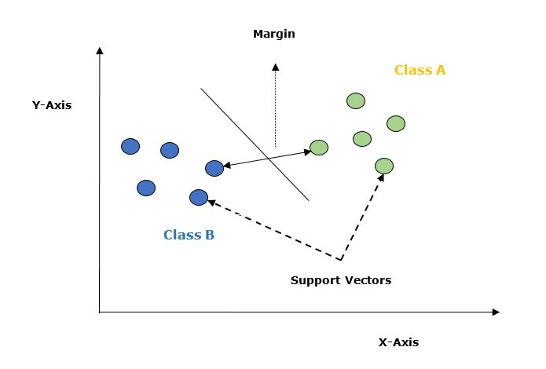

# Support Vector Machines (SVM) 

**Support Vector Machines (SVM)** are among the most robust and mathematically elegant classification algorithms in data mining. While other algorithms try to find any boundary that works, SVM is obsessed with finding the **Optimal Hyperplane**—the one that provides the greatest "safety buffer" between classes.

---

## 1. The Geometry of the "Safety Buffer"
The power of SVM lies in its objective: maximizing the **Margin**.

* **The Hyperplane:** In a 2D space, this is a line. In 3D, it’s a plane. In N-dimensions, it’s a hyperplane. It is defined by the equation: 
  $$w \cdot x + b = 0$$
* **Support Vectors:** These are the "VIP" data points. They are the observations that lie exactly on the marginal boundaries. If you remove any other data points, the hyperplane stays the same; but if you move a Support Vector, the entire model changes.
* **Maximum Margin:** The distance between the hyperplane and the nearest data point from either class. A larger margin leads to better generalization on new data.

---

## 2. Linear SVM: The Mathematical Goal
For a dataset that is linearly separable, SVM tries to solve a constrained optimization problem. We want to minimize the weight vector $w$ (which maximizes the margin) subject to the condition that all points are correctly classified:

$$\text{Minimize } \frac{1}{2} ||w||^2$$
$$\text{Subject to: } y_i(w \cdot x_i + b) \ge 1$$

To solve this, SVM uses **Lagrange Multipliers**, converting the problem into a "Dual Form" that only depends on the dot product of the input vectors.

---

## 3. The Kernel Trick: Moving to Higher Dimensions
Real-world data is rarely a straight line. Sometimes, data points of Class A are surrounded by Class B.

**The Logic:** If we cannot separate data in 2D, we project it into 3D (or higher). In this new space, we can pass a flat "sheet" (hyperplane) through the data.

### **Common Kernel Functions:**
1.  **Linear Kernel:** No transformation. Used when data is already separable.
2.  **Polynomial Kernel:** Represents the similarity of vectors in a feature space over polynomials of the original variables.
3.  **Radial Basis Function (RBF/Gaussian):** The most popular kernel. It can handle infinite-dimensional spaces and creates complex, circular boundaries.
4.  **Sigmoid Kernel:** Acts similarly to the activation functions in Neural Networks.

---

## 4. Tuning the SVM: Hyperparameters
To get the best performance, two parameters must be tuned carefully:

### **A. The C Parameter (Regularization)**
* **Small C:** Prioritizes a large margin, even if it means some training points are misclassified (Soft Margin). This prevents overfitting.
* **Large C:** Prioritizes classifying all training points correctly, even if the margin becomes very small. This can lead to overfitting.

### **B. Gamma ($\gamma$)**
* Only used with the RBF kernel.
* **Low Gamma:** The "influence" of a support vector reaches far. The boundary is smooth.
* **High Gamma:** The "influence" is local. The boundary is very wiggly and tries to "hug" every single data point.

---

## 5. Multi-Class Classification
SVM is naturally a binary classifier (Class A vs Class B). To handle multiple classes (e.g., Apple vs Orange vs Banana), it uses two strategies:
1.  **One-vs-One (OvO):** It builds a classifier for every possible pair of classes.
2.  **One-vs-All (OvA):** It builds a classifier for each class against all the others combined.

---

## 6. Comparison Table: SVM vs. The Rest

| Feature | Naive Bayes | Decision Trees | SVM |
| :--- | :--- | :--- | :--- |
| **Foundation** | Probability | Logic/Rules | Geometry/Optimization |
| **Boundary** | Linear/Simple | Axis-Parallel Steps | Smooth/Complex Curves |
| **Outliers** | Robust | Sensitive (without pruning) | Robust (due to Margin) |
| **Small Data** | Good | Moderate | Excellent |

---

## 7. When to Choose SVM?
* Use SVM when you have a **clear margin of separation**.
* Use SVM when your data has **high dimensions** (e.g., gene sequences or text features).
* Avoid SVM if your dataset is **extremely large** (millions of rows) because the training time increases cubically ($O(n^3)$).

---

### **Key Takeaways**
> SVM doesn't just look for *a* solution; it looks for the **strongest** solution by maximizing the gap between classes. Through the **Kernel Trick**, it can solve problems that appear impossible in lower dimensions.

---
# Algorithm: Support Vector Machines (SVM)
**Topic: Classification and Prediction (Unit 3)**

Support Vector Machines (SVM) is a classifier that finds the optimal hyperplane which maximizes the margin between two classes. It is highly effective for both linear and non-linear data (using the Kernel Trick).

---

## 1. Basic Working Steps
1.  **Map Data:** Plot the data points in an $n$-dimensional space (where $n$ is the number of features).
2.  **Identify Support Vectors:** Find the data points from each class that are closest to the boundary. These points are the "Support Vectors."
3.  **Calculate Hyperplane:** Determine the decision boundary (hyperplane) that is equidistant from the support vectors of both classes.
4.  **Maximize Margin:** Adjust the hyperplane to ensure the distance (margin) between the support vectors of the two classes is as large as possible.
5.  **Kernel Trick (Optional):** If data is not linearly separable, use a kernel function to project data into a higher dimension where a linear split is possible.

---

## 2. Key Formulas

### **A. Hyperplane Equation**
For a linear SVM, the decision boundary is:
$$w \cdot x + b = 0$$
* $w$ = Weight vector (normal to the hyperplane).
* $b$ = Bias (offset).

### **B. The Margin**
The distance between the two supporting planes ($w \cdot x + b = 1$ and $w \cdot x + b = -1$) is:
$$Margin = \frac{2}{\|w\|}$$
To get the maximum margin, we must **minimize** $\|w\|$.

### **C. Kernel Function (Example: RBF)**
To handle non-linear data:
$$K(x_i, x_j) = \exp(-\gamma \|x_i - x_j\|^2)$$

---

## 3. Practical Example

**Scenario: Classifying "Healthy" vs "Sick" based on two blood markers.**

| Patient | Marker A ($x_1$) | Marker B ($x_2$) | Class ($y$) |
| :--- | :--- | :--- | :--- |
| 1 | 2 | 2 | Healthy (+1) |
| 2 | 2 | 3 | Healthy (+1) |
| 3 | 5 | 5 | Sick (-1) |
| 4 | 6 | 5 | Sick (-1) |

### **Step 1: Identify Support Vectors**
By plotting the points, we see that Patient 1 $(2,2)$ and Patient 3 $(5,5)$ are the closest points to the "middle" between the two groups. These are our **Support Vectors**.

### **Step 2: Find the Hyperplane**
The middle point between $(2,2)$ and $(5,5)$ is roughly $(3.5, 3.5)$. 
A simple linear boundary could be: $x_1 + x_2 - 7 = 0$.

### **Step 3: Test a New Point**
New Patient: {Marker A = 1, Marker B = 1}
* $1 + 1 - 7 = -5$
* Since the result is negative (falling on the "Healthy" side of the plane), the patient is classified as **Healthy**.

**Decision:** The SVM creates a "clearance zone" (margin). Even if the new patient had slightly higher markers (e.g., 2.5), they would still safely fall into the Healthy cluster because of the maximized margin.