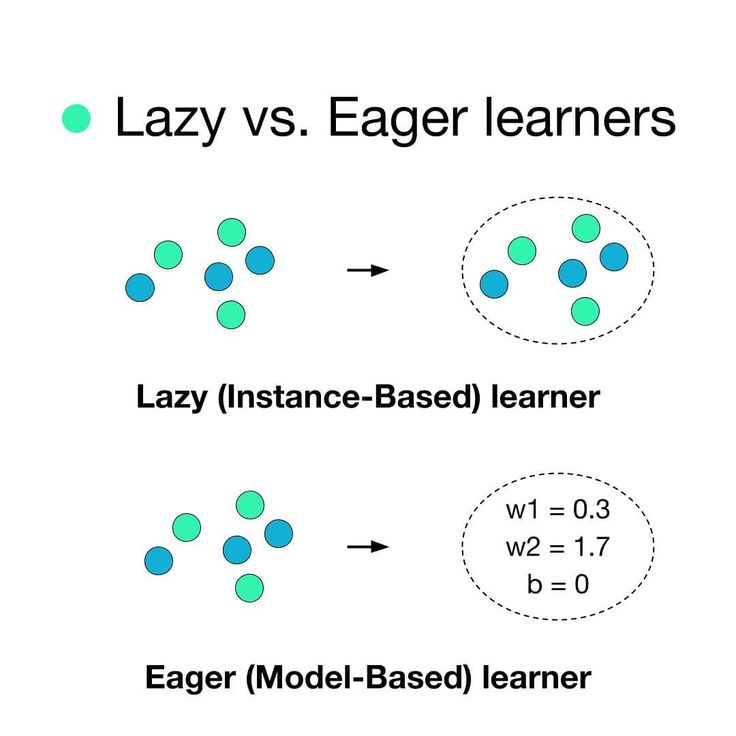
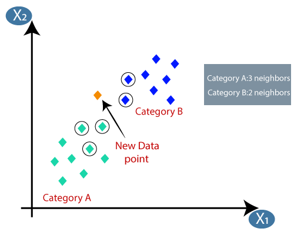

# Lazy Learners - K-Nearest Neighbors (KNN)

Unlike Decision Trees or Neural Networks, which spend a lot of time "learning" and building a model before they can make a prediction, **Lazy Learners** do almost no work during the training phase. Instead, they wait until they see a new test tuple and then "act" by searching through the stored data. **K-Nearest Neighbors (KNN)** is the most famous example of this approach.

---

## 1. The Concept: "Show Me Your Friends"
The philosophy of KNN is simple: **"Birds of a feather flock together."** If you want to know what class a new data point belongs to, look at its $K$ closest neighbors. If the majority of its neighbors belong to Class A, then the new point likely belongs to Class A too.

* **Eager Learners:** Build a general model (like a rule or a formula) that fits the whole data space.
* **Lazy Learners:** Don't build a model. They simply store the training data and perform "local" reasoning when a query arrives.



### **Why "Lazy" is Sometimes Smart**
Despite the name, lazy learning has a genuine theoretical advantage: it performs **local approximation** rather than forcing one global model onto the entire data space. This means KNN can naturally handle:
* Data with complex, non-linear decision boundaries
* Multiple distinct clusters with different local patterns
* Datasets where the best model changes drastically from one region to another

---

## 2. How the KNN Algorithm Works
The process is straightforward and involves these steps:

1.  **Store the Data:** All training tuples are stored in memory.
2.  **Calculate Distance:** When a new tuple arrives, calculate its distance to every single point in the training set.
3.  **Identify Neighbors:** Pick the $K$ points that are closest to the new tuple.
4.  **Vote:**
    * **For Classification:** Use "Majority Voting." The class that appears most often among the $K$ neighbors is assigned to the new point.
    * **For Regression:** Calculate the **average** (or weighted average) value of the $K$ neighbors.



### **Weighted KNN**
Standard KNN gives each neighbor an equal vote. **Weighted KNN** gives closer neighbours more influence by weighting votes by the inverse of their distance:

$$\hat{y} = \frac{\sum_{i=1}^{K} \frac{1}{d_i} \cdot y_i}{\sum_{i=1}^{K} \frac{1}{d_i}}$$

Where $d_i$ is the distance to the $i$-th neighbour and $y_i$ is its class label (or value for regression).

**Example:** If a point has 3 neighbours at distances 2, 5, and 10:
* Standard KNN: each vote = 1/3
* Weighted KNN: weights = $\frac{1}{2} : \frac{1}{5} : \frac{1}{10} = 5 : 2 : 1$ (nearest neighbour gets 5× more influence)

---

## 3. Measuring "Closeness": Distance Metrics
To find the "nearest" neighbors, we need to calculate the distance between points. The choice of metric depends on the type of data:

### **A. Euclidean Distance (Most Common)**
The straight-line distance between two points.
$$d(x, y) = \sqrt{\sum_{i=1}^{n} (x_i - y_i)^2}$$
* Best for continuous, normally distributed features.
* Sensitive to scale — always normalise before use.

### **B. Manhattan Distance**
The distance measured along axes at right angles (like walking through city blocks).
$$d(x, y) = \sum_{i=1}^{n} |x_i - y_i|$$
* More robust to outliers than Euclidean (no squaring).
* Better for high-dimensional data.

### **C. Minkowski Distance**
A generalised formula where you can adjust parameter $p$:
$$d(x, y) = \left(\sum_{i=1}^{n} |x_i - y_i|^p\right)^{1/p}$$
* $p = 1$: Manhattan Distance
* $p = 2$: Euclidean Distance
* $p \to \infty$: Chebyshev Distance (maximum single-dimension difference)

[Image comparing Euclidean vs Manhattan distance logic]

### **D. Hamming Distance (Categorical Data)**
For categorical or binary features, counts the number of positions where values differ:
$$d(x, y) = \sum_{i=1}^{n} \mathbb{1}[x_i \neq y_i]$$
* **Example:** "Cat" vs "Car" → differ in position 3 → Hamming distance = 1.

### **E. Cosine Similarity (Text / High-Dimensional Data)**
Measures the angle between two vectors rather than their magnitude:
$$\text{similarity}(x, y) = \frac{x \cdot y}{\|x\| \cdot \|y\|}$$
$$\text{distance} = 1 - \text{similarity}(x, y)$$
* Commonly used in text classification and document retrieval.
* Two documents with the same proportions of words score high regardless of length.

### **Distance Metric Comparison**

| Metric | Formula Type | Best For | Outlier Sensitive? |
|:---|:---|:---|:---|
| Euclidean | Quadratic | Continuous, low-dim data | Yes |
| Manhattan | Linear | Continuous, high-dim or sparse | Less so |
| Minkowski | Generalised | Tunable between the above | Depends on $p$ |
| Hamming | Count | Categorical / binary data | No |
| Cosine | Angular | Text, sparse vectors | No |

---

## 4. The Critical Importance of Feature Scaling

**KNN is one of the most scale-sensitive algorithms in machine learning.** Features with large ranges completely dominate the distance calculation.

### **Without Scaling — Example**

| Feature | Range | Effect on Distance |
|:---|:---|:---|
| Salary | 20,000 – 200,000 | Dominates (huge numbers) |
| Age | 18 – 65 | Barely contributes |
| Score | 0 – 100 | Minor contribution |

A difference of 1 year in Age is irrelevant compared to a $1,000 salary difference, even if age is the more important predictor.

### **Scaling Methods**

**Min-Max Normalisation** (scales to [0, 1]):
$$x' = \frac{x - x_{min}}{x_{max} - x_{min}}$$

**Z-Score Standardisation** (scales to mean=0, std=1):
$$x' = \frac{x - \mu}{\sigma}$$

> **Rule:** Always apply **one** of these before running KNN. Min-Max is preferred when you know the data range; Z-score is preferred when outliers exist.

---

## 5. Choosing the "K" Value
The parameter **$K$** is the most important setting in this algorithm.

* **Small K (e.g., $K=1$):** The model is very sensitive to "noise" and outliers. It might overfit because it only looks at the single closest neighbor.
* **Large K:** The model becomes "smoother" and more stable, but if $K$ is too large, it might include points from other classes, leading to "underfitting."
* **The "Odd Number" Rule:** Always pick an **odd number** for $K$ (e.g., 3, 5, 7) to avoid a "tie" during voting.

### **Effect of K — Visualised**

```
K=1 (Overfitting):              K=15 (Underfitting):
 ○ ○ × ○ ○                       ○ ○ ○ ○ ○
 ○ ×[×]× ○      →               ○ ○[○]○ ○
 ○ ○ × ○ ○                       ○ ○ ○ ○ ○
Tiny "island" of ×           × absorbed by majority ○s
around every outlier         Boundary too smooth
```

### **Finding Optimal K: The Elbow Method**

1. Try all odd values of $K$ from 1 to $\sqrt{n}$.
2. For each $K$, compute the **cross-validation error** on a validation set.
3. Plot error vs. $K$.
4. Choose the $K$ at the "elbow" — where the error stops decreasing significantly.

```
Error
  |
  |\ 
  | \
  |  \___
  |      \____
  |           \___________
  +------------------------→ K
     1  3  5  7  9  11
         ↑
      Elbow → optimal K
```

### **Rule of Thumb**
$$K \approx \sqrt{n}$$
Where $n$ = number of training samples. For $n = 100$: start with $K = 10$ (round to nearest odd: $K = 9$ or $11$).

---

## 6. KNN for Regression

KNN is not limited to classification. For **regression** (predicting a continuous value):

$$\hat{y} = \frac{1}{K} \sum_{i=1}^{K} y_i \quad \text{(standard average)}$$

Or with distance weighting:
$$\hat{y} = \frac{\sum_{i=1}^{K} \frac{y_i}{d_i}}{\sum_{i=1}^{K} \frac{1}{d_i}} \quad \text{(weighted average)}$$

**Example:** Predicting house price. The 3 nearest similar houses sold for $\$210k$, $\$225k$, $\$215k$.
* Standard: $\hat{y} = (210 + 225 + 215)/3 = \$216.7k$
* Weighted (distances 1.2, 2.5, 3.0): closer house gets more weight → $\hat{y} \approx \$213k$

---

## 7. Computational Challenges and Solutions

### **The Curse of Dimensionality**
As the number of features (dimensions) grows, distances between points become increasingly similar — the "nearest" neighbour is almost as far away as the "farthest."

**Intuition:** In 1D, 10 points cover a line well. In 100D, you need $10^{100}$ points to achieve the same coverage density.

**Solutions:**
* **Feature Selection:** Remove irrelevant features before applying KNN.
* **PCA / Dimensionality Reduction:** Project data to fewer dimensions.
* **Feature Importance Weighting:** Weight distances by feature relevance.

### **Speeding Up KNN: Data Structures**

Naïve KNN checks all $n$ training points for every query → $O(n \cdot d)$ per query.

| Structure | Description | Query Time | Best For |
|:---|:---|:---|:---|
| **Brute Force** | Compare to every point | $O(nd)$ | Small datasets |
| **KD-Tree** | Recursive binary space partitioning | $O(\log n)$ avg | Low dimensions ($d \leq 20$) |
| **Ball Tree** | Nested hyperspheres | $O(\log n)$ avg | Higher dimensions |
| **LSH (Locality Sensitive Hashing)** | Approximate nearest neighbours | $O(1)$ approx | Very large, high-dim datasets |

---

## 8. Pros and Cons of Lazy Learning

| Feature | Advantages | Disadvantages |
| :--- | :--- | :--- |
| **Training Time** | Zero — just stores the data | **Prediction Time** is very slow for large datasets |
| **Complexity** | Simple to understand and implement | **Memory Usage** is high — entire training set in RAM |
| **Adaptability** | Naturally handles new data (just add it) | **Sensitive to Scale** — must normalise features |
| **Non-Linear** | Can learn very complex boundaries | **Outlier Sensitive** — noisy data misguides the vote |
| **No Assumptions** | Makes no assumptions about data distribution | **Curse of Dimensionality** — degrades in high-dim space |
| **Multi-class** | Naturally handles $k > 2$ classes | **Irrelevant Features** — all features treated equally |

---

## 9. Real-World Applications
1.  **Recommender Systems:** "Users who liked this movie also liked..." (KNN finds similar users).
2.  **Credit Scoring:** Comparing a new applicant to similar historical profiles to predict risk.
3.  **Pattern Recognition:** Used in initial stages of optical character recognition (OCR).
4.  **Medical Detection:** Finding similar past cases of patients with specific symptoms.
5.  **Anomaly Detection:** A point with no close neighbours is likely an outlier or anomaly.
6.  **Image Classification:** Early image recognition systems used pixel-level KNN.
7.  **Drug Discovery:** Finding molecules similar in structure to known effective drugs.
8.  **Retail:** Finding customers with similar purchase history for targeted promotions.

---

## 10. Comparison: Eager vs. Lazy Learning

| Category | Eager Learners (Decision Tree, SVM, ANN) | Lazy Learners (KNN, Case-Based Reasoning) |
| :--- | :--- | :--- |
| **Learning Step** | Slow (Builds a global model) | Fast (Just stores data) |
| **Classification Step** | Fast (Just uses the model) | Slow (Must compare to all data) |
| **Model Storage** | Small (Only the rules/weights) | Large (Must store all training tuples) |
| **Generalization** | Commits to a single global hypothesis | Performs local, instance-specific reasoning |
| **Concept Drift** | Requires retraining | Adapts automatically (new data added directly) |
| **Interpretability** | Moderate to High | Low (no explicit model to inspect) |

---

## 11. Python Implementation

```python
from sklearn.neighbors import KNeighborsClassifier, KNeighborsRegressor
from sklearn.preprocessing import StandardScaler, MinMaxScaler
from sklearn.model_selection import train_test_split, cross_val_score, GridSearchCV
from sklearn.metrics import accuracy_score, classification_report
import numpy as np
import matplotlib.pyplot as plt

# --- Step 1: Feature Scaling (CRITICAL for KNN) ---
scaler = StandardScaler()   # or MinMaxScaler()
X_train_scaled = scaler.fit_transform(X_train)
X_test_scaled  = scaler.transform(X_test)

# --- Step 2: Train KNN Classifier ---
knn = KNeighborsClassifier(
    n_neighbors=5,        # K value
    metric='euclidean',   # 'euclidean', 'manhattan', 'minkowski', 'cosine'
    weights='uniform',    # 'uniform' (equal vote) or 'distance' (weighted vote)
    algorithm='auto'      # 'auto', 'ball_tree', 'kd_tree', 'brute'
)
knn.fit(X_train_scaled, y_train)
print("KNN Accuracy:", accuracy_score(y_test, knn.predict(X_test_scaled)))

# --- Step 3: Find Optimal K (Elbow Method) ---
k_range = range(1, 31, 2)   # Odd values only
cv_scores = []
for k in k_range:
    clf = KNeighborsClassifier(n_neighbors=k, weights='distance')
    scores = cross_val_score(clf, X_train_scaled, y_train, cv=5, scoring='accuracy')
    cv_scores.append(scores.mean())

# Plot error rate vs K
plt.figure(figsize=(10, 5))
plt.plot(k_range, [1 - s for s in cv_scores], marker='o', color='steelblue')
plt.xlabel('K Value')
plt.ylabel('Cross-Validation Error Rate')
plt.title('Elbow Method for Optimal K')
plt.grid(True)
plt.tight_layout()
plt.savefig('knn_elbow.png', dpi=150)
plt.show()

best_k = list(k_range)[cv_scores.index(max(cv_scores))]
print(f"Optimal K: {best_k}")

# --- Step 4: Grid Search over K and metric ---
param_grid = {
    'n_neighbors': list(range(1, 21, 2)),
    'weights':     ['uniform', 'distance'],
    'metric':      ['euclidean', 'manhattan']
}
grid = GridSearchCV(KNeighborsClassifier(), param_grid, cv=5, scoring='accuracy')
grid.fit(X_train_scaled, y_train)
print("Best Parameters:", grid.best_params_)

# --- Step 5: KNN Regression ---
knn_reg = KNeighborsRegressor(n_neighbors=5, weights='distance', metric='euclidean')
knn_reg.fit(X_train_scaled, y_train_reg)
from sklearn.metrics import mean_squared_error
mse = mean_squared_error(y_test_reg, knn_reg.predict(X_test_scaled))
print(f"KNN Regressor RMSE: {np.sqrt(mse):.4f}")

# --- Step 6: Find nearest neighbours of a new point ---
distances, indices = knn.kneighbors(X_test_scaled[:1])
print("Distances to 5 nearest neighbours:", distances[0])
print("Indices of 5 nearest neighbours:", indices[0])
```

---

# Algorithm: k-Nearest Neighbor (k-NN)

k-NN is a non-parametric, "lazy learning" algorithm that classifies a data point based on how its neighbors are classified. It stores the entire training dataset and performs a calculation only when a new query is made.

---

## 1. Basic Working Steps
1.  **Select 'k':** Choose the number of nearest neighbors (usually an odd number to avoid ties).
2.  **Calculate Distance:** Compute the distance between the new test point and all points in the training dataset.
3.  **Find Neighbors:** Sort the distances in ascending order and pick the top $k$ closest points.
4.  **Vote:** Count the number of points in each category among the $k$ neighbors.
5.  **Classify:** Assign the test point to the class that appears most frequently.

---

## 2. Key Formulas

### **A. Euclidean Distance**
The most common metric for calculating distance between two points in $n$-dimensional space:
$$d(x, y) = \sqrt{\sum_{i=1}^{n} (x_i - y_i)^2}$$

### **B. Manhattan Distance**
$$d(x, y) = \sum_{i=1}^{n} |x_i - y_i|$$

### **C. Minkowski Distance (General)**
$$d(x, y) = \left(\sum_{i=1}^{n} |x_i - y_i|^p\right)^{1/p}$$

### **D. Weighted Voting (Regression / Weighted KNN)**
$$\hat{y} = \frac{\sum_{i=1}^{K} \frac{y_i}{d_i}}{\sum_{i=1}^{K} \frac{1}{d_i}}$$

### **E. Rule of Thumb for 'k'**
$$k \approx \sqrt{n}$$

Where $n$ = total number of training samples.


---

## 3. Practical Example

**Dataset: Predict if a "Book" is "Heavy" or "Light" based on its "Number of Pages" and "Cost".**

| Book | Pages ($x_1$) | Cost ($x_2$) | Class |
| :--- | :--- | :--- | :--- |
| A | 167 | 51 | Light |
| B | 176 | 69 | Heavy |
| C | 174 | 56 | Light |
| D | 173 | 64 | Heavy |

**Test Case (X):** {Pages = 170, Cost = 57}, **Set $k = 3$**

### **Step 1: Calculate Euclidean Distance from X**
* **Dist(X, A):** $\sqrt{(170-167)^2 + (57-51)^2} = \sqrt{9 + 36} = \sqrt{45} \approx \mathbf{6.71}$
* **Dist(X, B):** $\sqrt{(170-176)^2 + (57-69)^2} = \sqrt{36 + 144} = \sqrt{180} \approx \mathbf{13.42}$
* **Dist(X, C):** $\sqrt{(170-174)^2 + (57-56)^2} = \sqrt{16 + 1} = \sqrt{17} \approx \mathbf{4.12}$
* **Dist(X, D):** $\sqrt{(170-173)^2 + (57-64)^2} = \sqrt{9 + 49} = \sqrt{58} \approx \mathbf{7.62}$

### **Step 2: Identify 3 Nearest Neighbors**

| Rank | Book | Distance | Class |
|:---|:---|:---|:---|
| 1 | C | 4.12 | Light |
| 2 | A | 6.71 | Light |
| 3 | D | 7.62 | Heavy |

### **Step 3: Majority Vote**
* Neighbors: {Light, Light, Heavy}
* Light = 2 votes, Heavy = 1 vote
* Most frequent class: **Light**

**Decision:** The new book is classified as **Light**.

### **Step 4: Weighted Vote (Bonus)**

Using inverse-distance weighting:
* Weight of C: $1/4.12 \approx 0.243$
* Weight of A: $1/6.71 \approx 0.149$
* Weight of D: $1/7.62 \approx 0.131$

| Class | Total Weight |
|:---|:---|
| Light (C + A) | $0.243 + 0.149 = \mathbf{0.392}$ |
| Heavy (D) | $\mathbf{0.131}$ |

Weighted decision: **Light** (0.392 > 0.131) — same result, but with higher confidence.

---

## 4. Quick Reference Card

| Concept | Formula / Rule | Notes |
|:---|:---|:---|
| Euclidean distance | $\sqrt{\sum(x_i - y_i)^2}$ | Most common; scale-sensitive |
| Manhattan distance | $\sum\|x_i - y_i\|$ | Robust; good for high-dim |
| Minkowski distance | $(\sum\|x_i-y_i\|^p)^{1/p}$ | General form |
| Weighted vote | $\sum (y_i/d_i) / \sum (1/d_i)$ | Closer neighbours count more |
| Optimal K | $K \approx \sqrt{n}$, odd | Use elbow method to confirm |
| Small K | Sensitive, overfits | High variance, low bias |
| Large K | Smooth, underfits | Low variance, high bias |
| Must do | Normalise features | Scale before computing distances |
| Prediction cost | $O(n \cdot d)$ per query | Use KD-tree for large datasets |