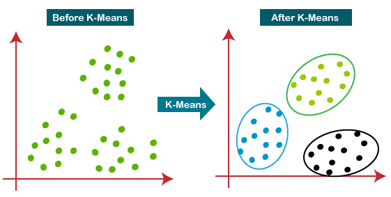

# Partitioning Methods

In data mining, partitioning methods are the most intuitive clustering techniques. They work by creating $k$ groups from a set of $n$ objects, where each group represents a cluster. These methods are "iterative" because they constantly relocate objects between clusters to reach an optimal configuration.

---

## **1. Fundamental Concept & Mathematical Basis**
Partitioning algorithms aim to minimize a **Cost Function** (also known as the Squared Error Criterion). The goal is to make the objects within a cluster as close to each other as possible.

### **Distance Metrics**
To decide which cluster an object belongs to, the algorithm calculates the distance between the object ($p$) and the cluster center ($c$).
* **Euclidean Distance:** The most common metric for continuous data.
* **Manhattan Distance:** Often used when data is less "straight-line" or has many outliers.
* **Minkowski Distance:** A generalized version of both Euclidean and Manhattan distances.

---

## **2. K-Means: The Centroid Approach**
K-Means defines the center of a cluster as the **Centroid** (the mean value of all points in the cluster).

### **The Algorithm Logic**
1.  **Initialize:** Select $k$ points randomly as initial centroids.
2.  **Assign:** Calculate the distance of each object to these $k$ centroids and assign it to the nearest one.
3.  **Update:** Compute the new mean for each cluster to find the new centroid.
4.  **Converge:** Repeat until the assignments no longer change.

---

## **3. K-Medoids: The Representative Object Approach**
K-Medoids is a more robust alternative to K-Means. It uses an actual data point from the dataset, called a **Medoid**, to represent the cluster.

### **Why use K-Medoids?**
* **Outlier Sensitivity:** K-Means is easily "pulled" by extreme values because the mean is affected by outliers.
* **Robustness:** Since a medoid must be an actual data point, it is less influenced by random noise or extreme values.

### **PAM (Partitioning Around Medoids) Algorithm**
1.  **Select:** Randomly pick $k$ objects as medoids.
2.  **Associate:** Assign each remaining object to the nearest medoid.
3.  **Swap:** Randomly select a non-medoid object and calculate the cost of swapping it with an existing medoid.
4.  **Accept:** If the total cost of the new configuration is lower, the swap is permanent.

---

## **4. Comparison: K-Means vs. K-Medoids**

| Feature | K-Means | K-Medoids (PAM) |
| :--- | :--- | :--- |
| **Cluster Center** | Calculated Mean (Centroid) | Actual Data Point (Medoid) |
| **Efficiency** | Faster ($O(tkn)$) - Good for large data | Slower ($O(k(n-k)^2)$) - Best for small data |
| **Sensitivity** | Highly sensitive to outliers | Robust to noise and outliers |
| **Result** | Local optimum | More stable, representative results |

---

## **5. How to Choose the Value of 'K'?**
Since $k$ must be specified by the user, we often use the **Elbow Method**.
* We run the algorithm for different values of $k$ (e.g., 1 to 10).
* We plot the **Sum of Squared Errors (SSE)** against $k$.
* The point where the curve "bends" like an elbow is considered the optimal number of clusters.

---

## **6. Summary of Partitioning Methods**
* **Best for:** Finding spherical-shaped clusters that are well-separated.
* **Weakness:** It struggles with clusters of different sizes, densities, or non-spherical shapes.
* **Memory:** Requires the data to be kept in memory, which can be a challenge for massive datasets.

---

# Algorithm: K-Means Clustering
**Topic: Cluster Analysis (Unit 4)**

K-Means is a centroid-based partitioning algorithm that groups data points into $k$ clusters by minimizing the distance between the points and their respective cluster centers.

---

## 1. Basic Working Steps
1.  **Initialize:** Choose the number of clusters $k$ and randomly select $k$ data points as initial centroids.
2.  **Assignment:** Assign each data point to the nearest centroid based on a distance metric.
3.  **Update:** Calculate the new mean (centroid) for each cluster by averaging all the points assigned to it.
4.  **Repeat:** Iterate the Assignment and Update steps until the centroids no longer move or the maximum number of iterations is reached.

---

## 2. Key Formulas

### **A. Euclidean Distance**
The distance between a point $x$ and a centroid $c$:
$$d(x, c) = \sqrt{\sum_{i=1}^{n} (x_i - c_i)^2}$$

### **B. Objective Function (SSE)**
K-Means aims to minimize the Sum of Squared Errors (SSE):
$$SSE = \sum_{j=1}^{k} \sum_{x \in C_j} dist(x, c_j)^2$$

---

## 3. Practical Example

**Dataset:** {2, 4, 10, 12, 3, 20, 30, 11, 25}  
**Set $k = 2$.** Assume initial centroids: $c_1 = 2, c_2 = 4$.

### **Step 1: First Assignment**
* Point 2: Near $c_1$ (Dist 0) → Cluster 1
* Point 4: Near $c_2$ (Dist 0) → Cluster 2
* Point 10: Near $c_2$ (Dist 6) → Cluster 2
* Point 3: Near $c_1$ (Dist 1) → Cluster 1
* ...and so on.

### **Step 2: Update Centroids**
Suppose Cluster 1 has {2, 3, 4} and Cluster 2 has {10, 11, 12, 20, 25, 30}.
* **New $c_1$:** $(2+3+4) / 3 = \mathbf{3}$
* **New $c_2$:** $(10+11+12+20+25+30) / 6 = \mathbf{18}$

### **Step 3: Second Assignment**
Now, the point "4" is closer to the new $c_1$ (3) than $c_2$ (18). It will shift to Cluster 1.

**Decision:** The process continues until the points stop shifting between the "low value" cluster and the "high value" cluster.

---

# Algorithm: K-Medoids (PAM - Partitioning Around Medoids)

K-Medoids is a representative object-based clustering algorithm. Unlike K-Means (which uses the mean of points), K-Medoids picks an **actual data point** from the dataset to act as the center of the cluster. This makes it significantly more robust to noise and outliers.

---

## 1. Basic Working Steps (PAM)
1.  **Initialize:** Randomly select $k$ data points from the dataset as the initial **medoids**.
2.  **Assignment:** Assign each remaining data point to the cluster of the nearest medoid.
3.  **Calculate Total Cost:** Compute the sum of absolute distances from points to their respective medoids.
4.  **Swap (Iterate):** * Randomly select a non-medoid point $O_{random}$.
    * Temporarily swap an existing medoid $M$ with $O_{random}$.
    * Re-calculate the total cost of the new configuration.
5.  **Decide:** If the new total cost is lower, make the swap permanent. If higher, undo the swap.
6.  **Terminate:** Repeat until the medoids no longer change.

---

## 2. Key Formulas

### **A. Total Cost (Absolute Error Criterion)**
K-Medoids aims to minimize the sum of dissimilarities:
$$E = \sum_{j=1}^{k} \sum_{p \in C_j} |p - m_j|$$
* $p$ is a data point in cluster $C_j$.
* $m_j$ is the medoid of cluster $C_j$.

### **B. Manhattan Distance**
While Euclidean can be used, K-Medoids often uses Manhattan distance to maintain robustness:
$$d(i, j) = |x_{i1} - x_{j1}| + |x_{i2} - x_{j2}| + \dots$$

---

## 3. Practical Example

**Dataset:** {10, 12, 14, 15, 100}  
**Set $k = 2$.** Assume initial medoids are: $m_1 = 10$ and $m_2 = 12$.

### **Step 1: Initial Cost Calculation**
* Points assigned to $m_1 (10)$: {10} → Distance = 0
* Points assigned to $m_2 (12)$: {12, 14, 15, 100} → Distances = $(0 + 2 + 3 + 88) = 93$
* **Total Cost ($E_1$) = 93**

### **Step 2: Swap Medoid $m_2 (12)$ with non-medoid point $15$**
New medoids: $m_1 = 10, m_2 = 15$.
* Points for $m_1 (10)$: {10, 12} → Distances = $(0 + 2) = 2$
* Points for $m_2 (15)$: {14, 15, 100} → Distances = $(1 + 0 + 85) = 86$
* **Total Cost ($E_2$) = 2 + 86 = 88**

### **Step 3: Comparison**
* **$E_2 (88) < E_1 (93)$**
* Since the new cost is lower, the swap is **accepted**. The new medoids are 10 and 15.

**Decision:** The algorithm prevents the outlier (100) from pulling the "center" as drastically as a mean would, as the medoid must remain one of the actual typical data points.