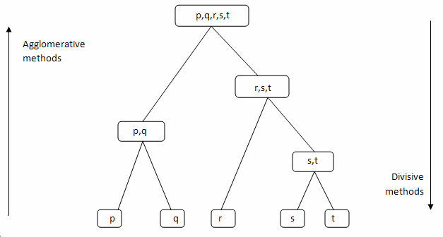

# Hierarchical Methods: Agglomerative versus Divisive

Imagine you are at a massive family reunion with 100 people you’ve never met. To make sense of the crowd, you want to group them. You could start by finding the person most like you (your sibling) and forming a pair, then finding another pair nearby, and slowly building up to a "family tree." This is exactly how **Hierarchical Clustering** works.

Unlike partitioning methods (like K-Means), you don't need to decide how many groups you want at the start. Instead, you build a tree called a **Dendrogram** that shows the relationship between every single person in the room.

---

## 1. Two Approaches: Bottom-Up vs. Top-Down

In data science, we build this tree in two opposite ways.

### **A. Agglomerative: The "Friendship" Approach (Bottom-Up)**
This is the most common method used in the real world.
* **The Story:** Imagine every data point is a lonely individual standing in a field. 
* **The Process:** First, the two people standing closest to each other hold hands and become a "pair". Then, the next two closest people or groups merge. 
* **The Result:** Slowly, pairs become small groups, small groups become large tribes, and eventually, everyone is holding hands in one giant circle.
* **Technical Note:** It starts with $n$ clusters and ends with 1.

### **B. Divisive: The "Kingdom" Approach (Top-Down)**
This is much rarer because it’s a lot of work for the computer.
* **The Story:** Imagine the entire world is one giant empire. 
* **The Process:** The king decides the empire is too big and splits it into two separate countries based on their differences. Then, those countries split into states, then cities, then neighborhoods.
* **The Result:** The process stops only when every single person is their own independent "country".
* **Technical Note:** It starts with 1 cluster and ends with $n$.

---

## 2. How Do We Measure "Closeness"? (Linkage Metrics)

If we are merging groups, how do we decide which groups are "closest"? Data scientists use different "linkage" rules:

* **Single Linkage (The Bridge):** You only look at the two people (points) who are the absolute closest to each other between two groups. It’s like a single handshake connecting two massive crowds.
* **Complete Linkage (The Long Distance):** You look at the two people who are the farthest apart between two groups. This ensures the groups are very compact.
* **Average Linkage (The Community):** You calculate the distance between every person in Group A and every person in Group B and take the average. This is the most "fair" and stable method.
* **Centroid Linkage (The Leaders):** You find the "average person" (center) of each group and measure the distance between those two leaders.

---

## 3. The Dendrogram: Your Data's Family Tree

The result of this story is a **Dendrogram**.
* **How to read it:** The bottom "leaves" are your data points. The vertical lines show where groups merged. 
* **The Power of the Scissors:** The coolest part? You can take a pair of "virtual scissors" and cut the tree at any height to get the exact number of clusters you need for your project.

---

## 4. Comparison Summary

| Feature | Agglomerative (Bottom-Up) | Divisive (Top-Down) |
| :--- | :--- | :--- |
| **Starting Point** | Start with many, end with 1. | Start with 1, end with many. |
| **Complexity** | Efficient for most tasks. | Very slow and complex. |
| **Analogy** | Building a Lego set piece by piece. | Breaking a large glass into tiny shards. |

---

## 5. Why Love (and Hate) Hierarchical Clustering

### **The Good Stuff (Advantages)**
* **No Guessing:** You don't have to guess the value of 'K' (number of clusters) before you start.
* **Beautiful Visuals:** The Dendrogram makes it very easy to explain your results to a boss or professor.

### **The Tough Stuff (Limitations)**
* **No Undo Button:** Once the algorithm merges two groups, it can never "un-merge" them, even if it was a mistake.
* **Slow Motion:** If you have 1 million data points, the computer will struggle to build this tree.
* **Noise Sensitivity:** One "weird" data point (outlier) can ruin the shape of the entire family tree.

---

# Algorithm: AGNES (Agglomerative Nesting)
**Topic: Cluster Analysis (Unit 4)**

AGNES is a bottom-up hierarchical clustering algorithm. It starts by treating each data point as an individual cluster and iteratively merges the closest pairs of clusters until only one giant cluster remains or a termination condition is met.

---

## 1. Basic Working Steps
1.  **Initialize:** Treat each data point as a single-element cluster.
2.  **Distance Matrix:** Calculate the distance between all pairs of clusters.
3.  **Merge:** Find the two clusters with the minimum distance and merge them into a single cluster.
4.  **Update Matrix:** Recalculate the distances between the new cluster and all remaining clusters.
5.  **Repeat:** Continue merging until all points are in one cluster or the desired number of clusters is reached.
6.  **Visualize:** Represent the merging process using a **Dendrogram**.

---

## 2. Key Formulas (Linkage Metrics)

The "closeness" of two clusters $C_1$ and $C_2$ is determined by the linkage method:

### **A. Single Linkage (Nearest Neighbor)**
$$d(C_1, C_2) = \min \{d(x, y) : x \in C_1, y \in C_2\}$$

### **B. Complete Linkage (Farthest Neighbor)**
$$d(C_1, C_2) = \max \{d(x, y) : x \in C_1, y \in C_2\}$$

### **C. Average Linkage**
$$d(C_1, C_2) = \frac{1}{|C_1| \cdot |C_2|} \sum_{x \in C_1} \sum_{y \in C_2} d(x, y)$$

---

## 3. Practical Example

**Dataset:** A, B, C, D (1D points: A=1, B=2, C=5, D=6)

### **Step 1: Initial Clusters**
{A}, {B}, {C}, {D}

### **Step 2: First Merge**
* Dist(A,B) = 1 (Minimum)
* Merge {A} and {B} → New Clusters: **{A, B}**, {C}, {D}

### **Step 3: Second Merge**
* Dist(C,D) = 1 (Minimum)
* Merge {C} and {D} → New Clusters: **{A, B}**, **{C, D}**

### **Step 4: Final Merge**
* Dist({A,B}, {C,D}) using Single Linkage is Dist(B,C) = 3.
* Merge all → **{A, B, C, D}**

**Decision:** The Dendrogram allows you to "cut" the tree at a specific height to choose how many clusters you want (e.g., cutting at height 2 gives you 2 clusters).

---

# Algorithm: DIANA (Divisive Analysis)

DIANA is a top-down (divisive) hierarchical clustering algorithm. It starts with one single cluster containing all data points and iteratively splits the most heterogeneous cluster into smaller ones until every point is in its own cluster.

---

## 1. Basic Working Steps
1.  **Initialize:** Start with all data points in one single cluster ($C$).
2.  **Find the "Splinter":** In the current cluster, find the point that has the maximum average distance to all other points in the same cluster. This point initiates a new "Splinter Group."
3.  **Reassignment:** For each point in the original cluster, check if it is closer to the "Splinter Group" than to the remaining points in the original cluster. If yes, move it to the Splinter Group.
4.  **Repeat:** Select the cluster with the largest diameter (maximum distance between any two points) and repeat the splitting process.
5.  **Termination:** Stop when each point is in its own cluster or the desired number of clusters is reached.

---

## 2. Key Formulas

### **A. Average Distance (To find the Splinter)**
For a point $i$ in cluster $C$:
$$AvgDist(i, C) = \frac{1}{|C|-1} \sum_{j \in C, j \neq i} dist(i, j)$$
The point with the **maximum** $AvgDist$ is moved to the Splinter Group first.

### **B. Cluster Diameter**
To decide which cluster to split next:
$$Diameter(C) = \max_{x, y \in C} dist(x, y)$$

---

## 3. Practical Example

**Dataset:** {A, B, C, D, E} where {A, B} are close to each other and {C, D, E} are close to each other, but far from {A, B}.

### **Step 1: Start with All**
Current Cluster: **{A, B, C, D, E}**

### **Step 2: Initiate Splinter**
Suppose point **A** has the highest average distance to {B, C, D, E}.
* Original Group: {B, C, D, E}
* Splinter Group: {A}

### **Step 3: Reassign**
Check point **B**. Since **B** is much closer to **A** than to {C, D, E}, **B** moves to the Splinter Group.
* Original Group: {C, D, E}
* Splinter Group: {A, B}

### **Step 4: Continue**
Now you have two clusters: {A, B} and {C, D, E}. You would next pick the cluster with the larger diameter (likely {C, D, E}) and perform the same logic to split it further.

**Decision:** DIANA is less common than AGNES because it is computationally more expensive (finding the best split is harder than finding the best merge).