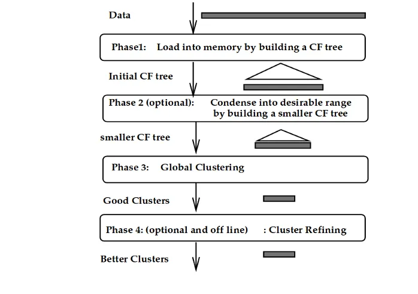

# BIRCH: Balanced Iterative Reducing and Clustering using Hierarchies

If K-Means is a basic calculator and Hierarchical clustering is a family tree, **BIRCH** is the "Super-Computer" of clustering. It was designed specifically for **very large datasets** where the data is too big to fit into the computer's RAM.

---

## 1. The Scenario: The Librarian and the Giant Library
Imagine you are a librarian in a library with **10 billion books**. You can't possibly look at every book every time someone asks a question. 

* **The BIRCH Solution:** Instead of looking at every book, you create a "Summary Card" for every shelf. Then, you create a "Summary of Summaries" for every floor.
* **The Result:** When someone asks for a book, you don't search 10 billion items; you just look at a few summary cards to find exactly where to go.

---

## 2. Core Concept: The Clustering Feature (CF)
The magic of BIRCH lies in how it summarizes data without losing the information needed for clustering. Instead of storing 1,000 points, it stores one **CF Vector**.

A **CF** is a triple summarizing information about a cluster of points: **CF = (n, LS, SS)**.

* **n (Number of points):** The count of data points in the cluster.
* **LS (Linear Sum):** The $n$-dimensional sum of the points ($\sum_{i=1}^{n} X_i$).
* **SS (Squared Sum):** The sum of the squares of the data points ($\sum_{i=1}^{n} X_i^2$).

**The Additivity Theorem:** If you have two clusters, $CF_1$ and $CF_2$, and you merge them, the new cluster's feature is simply:
$$CF_{new} = (n_1 + n_2, LS_1 + LS_2, SS_1 + SS_2)$$
This allows BIRCH to process data incrementally without rescanning old points.

---

## 3. The CF-Tree Structure
The CF-Tree is a height-balanced tree that stores these summaries. It is defined by two key parameters:

1.  **Branching Factor (B):** The maximum number of children a non-leaf node can have.
2.  **Threshold (T):** The maximum diameter (or radius) of a cluster represented by a leaf node. If a new point makes the cluster exceed this size, the node must split.

---

## 4. The 4 Phases of BIRCH
BIRCH builds its "library" in four distinct steps:

1.  **Phase 1 (Initial Loading):** The algorithm scans the database and builds the initial CF-Tree in memory. This is the most important step.
2.  **Phase 2 (Condensing):** (Optional) BIRCH shrinks the tree by increasing the threshold $T$ to fit the tree into the available RAM.
3.  **Phase 3 (Global Clustering):** Since the CF-Tree is just a summary, BIRCH now applies a standard clustering algorithm (like K-Means) to the leaf nodes to find the final clusters.
4.  **Phase 4 (Refining):** (Optional) It makes a final pass over the raw data to re-assign points to their closest clusters and remove outliers.

---

## 5. Evaluation of BIRCH

### **The Strengths (Why it's a "Super-Computer")**
* **Scalability:** It is $O(n)$, meaning its time increases linearly with data size.
* **Single Scan:** It only needs to read the dataset from the disk **one time**.
* **Noise Handling:** It can identify and filter out outliers (noise) during the tree-building process.

### **The Weaknesses (The Catch)**
* **Spherical Bias:** Because it uses the "radius" or "diameter" to split nodes, it naturally creates circular clusters. It fails on "S-shaped" or "C-shaped" clusters.
* **Input Order:** If you shuffle the data, the CF-Tree might look different, potentially changing the final clusters.
* **Numerical Data Only:** It is strictly designed for continuous (numeric) data.

---

## 6. Comparison Table

| Feature | K-Means | Hierarchical | BIRCH |
| :--- | :--- | :--- | :--- |
| **Complexity** | $O(n)$ | $O(n^2)$ | $O(n)$ |
| **Memory** | High (stores all points) | High | **Very Low (stores summaries)** |
| **Passes** | Multiple | Many | **Single Pass** |
| **Best For** | Medium data | Small data | **Big Data** |

---

# Algorithm: BIRCH (Balanced Iterative Reducing and Clustering using Hierarchies)

BIRCH is an integrated hierarchical clustering algorithm designed for very large datasets. It summarizes data into **Clustering Features (CF)** and organizes them into a **CF-Tree**, allowing it to process the data in a single scan.

---

## 1. Basic Working Steps
1.  **Phase 1 (Load):** Scan the entire database to build an initial in-memory CF-Tree.
2.  **Phase 2 (Condense):** (Optional) Rebuild the CF-Tree to a smaller size if the initial tree exceeds memory limits.
3.  **Phase 3 (Global Clustering):** Use an existing clustering algorithm (like K-Means or Agglomerative) to cluster all leaf entries of the CF-Tree.
4.  **Phase 4 (Refine):** (Optional) Perform a final pass to re-assign data points to the closest centroids to fix any inaccuracies from Phase 3.

---

## 2. Key Formulas

### **A. Clustering Feature (CF) Triple**
A CF represents a summary of a cluster. For a cluster with $n$ $d$-dimensional points $\{X_1, X_2, \dots, X_n\}$, the CF is:
$$CF = (n, LS, SS)$$
* **n:** Number of points in the cluster.
* **LS (Linear Sum):** $\sum_{i=1}^{n} X_i$
* **SS (Squared Sum):** $\sum_{i=1}^{n} X_i^2$

### **B. CF Additivity Theorem**
If two disjoint clusters $CF_1 = (n_1, LS_1, SS_1)$ and $CF_2 = (n_2, LS_2, SS_2)$ are merged, the new CF is:
$$CF_{new} = (n_1 + n_2, LS_1 + LS_2, SS_1 + SS_2)$$

---

## 3. Practical Example

**Scenario:** Summarizing a 1D cluster containing three points: **{2, 3, 4}**.

### **Step 1: Calculate CF**
* **n:** 3
* **LS:** $2 + 3 + 4 = 9$
* **SS:** $2^2 + 3^2 + 4^2 = 4 + 9 + 16 = 29$
* **CF Value:** $(3, 9, 29)$

### **Step 2: Add a new point {5} to this cluster**
New $CF = (3+1, 9+5, 29+5^2) = (4, 14, 54)$

### **Step 3: Tree Insertion**
The algorithm compares the new point's distance to existing CFs in the tree. If adding the point to a leaf exceeds the **Threshold (T)** (maximum diameter), the leaf node is split.

**Decision:** BIRCH is efficient because it never needs to look at the original points (2, 3, 4) again; it only uses the $(n, LS, SS)$ summaries to calculate distances and diameters.