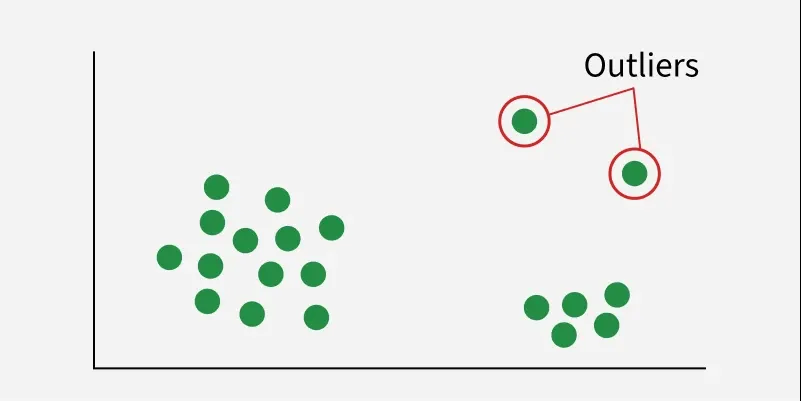

# Introduction to Outliers

An **outlier** is a data object that deviates significantly from the rest of the objects in a dataset. It is as if that object was generated by a different mechanism compared to the normal data. In many applications, the rare data (outliers) are more interesting and valuable than the common data.

---

## 1. The Story: The "Black Sheep" in the Flock
Imagine a shepherd who has a flock of 1,000 sheep. Every day, he records their weight. 999 sheep weigh between 45kg and 55kg. However, one sheep weighs **120kg**.

* **The Shepherd's View:** This sheep is an outlier. 
* **The Analysis:** Why is it so heavy? Is it a different breed? Is it sick (bloated)? Or was there an error in the weighing scale? 

In Data Mining, if this were a bank, the 999 sheep are "normal customers," and the 120kg sheep is a "fraudulent transaction." Outlier detection is the process of finding these "Black Sheep" before they cause trouble.

---

## 2. Classification of Outliers
Outliers are generally categorized into three types based on their behavior:

* **Global Outliers (Point Outliers):** A data point is a global outlier if it deviates significantly from the entire dataset. 
    * *Example:* A credit card transaction of $100,000 for a person who usually spends $50.
* **Contextual Outliers (Conditional Outliers):** A data point is an outlier only in a specific context. 
    * *Example:* 35°C is normal in Mumbai during May, but 35°C in Mumbai during December is a contextual outlier.
* **Collective Outliers:** A group of data points that collectively deviate from the whole dataset, even if individual points within the group appear normal.
    * *Example:* A single delayed packet in a network is normal, but a large group of delayed packets together might indicate a cyber-attack.

---
