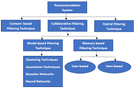
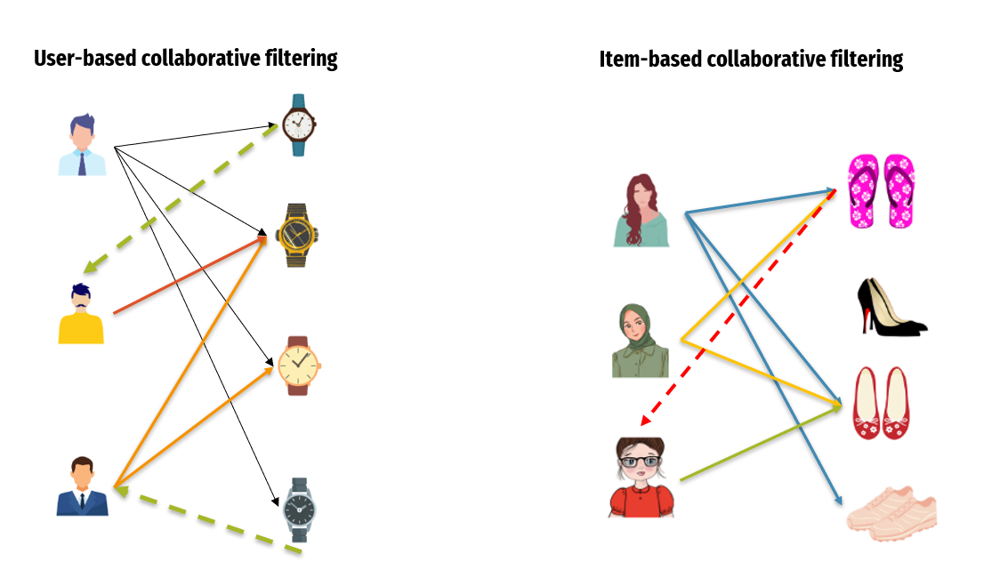

# Data Mining and Recommender Systems

Data mining leverages statistical methodologies and various algorithms—such as classification, clustering, and regression—to exploit insights buried in large datasets. In the context of **Recommender Systems**, these data mining techniques are used to analyze patterns of likes and dislikes to provide high-quality, personalized suggestions to users.

---

## 1. The Story: Your Personal Digital Concierge
Imagine you are at a massive shopping mall with thousands of stores. You feel overwhelmed and don't know where to find a shirt that fits your specific style.

* **The Old Way:** You walk floor by floor, looking at every window, which takes hours and is exhausting.
* **The Recommender Way:** A "Digital Concierge" (the recommender system) meets you at the entrance. It looks at your digital "diary" of past purchases—perhaps you bought a blue linen shirt last month and frequently visit bookstores. 
* **The Insight:** The concierge says, "Most people who liked that blue linen shirt also bought these specific leather sandals. Since you also like books, there is a quiet cafe in that store you might enjoy."

By analyzing your history and comparing it with thousands of other shoppers, the system acts as an unbiased personal team that helps you make decisions efficiently.

---

## 2. Core Objectives of Recommender Systems
The primary goal is to supply accessible, high-quality recommendations that have a high probability of being liked or needed by a user. They answer critical "next-step" questions:
* Which movie or web series should I watch next?
* Which book matches the genre I usually enjoy?
* Which items should I buy that complement my previous purchases?
* Should I visit a particular place based on my travel history?

---

## 3. Types of Recommendation Techniques

### **A. User-Based Recommendation**
This approach focuses on finding similarity between different users. It identifies "neighbors" who follow the same pattern of likes and dislikes. 
* **Logic:** If User A and User B have rated many items similarly in the past, the system recommends items liked by User B to User A.

### **B. Item-Based Recommendation**
This approach focuses on the similarity between items rather than users. It often uses a "mean adjusted matrix" to predict a new user's rating for an item.
* **Logic:** This reduces inconsistencies caused by "harsh" raters (who always give low scores) or "easy" raters (who always give high scores) by subtracting the mean value from each user's rating.

---

## **Algorithm: Similarity Measures in Recommendations**

To make accurate suggestions, recommender systems must mathematically calculate how "close" two users or items are.

### **1. User-Based: Pearson Similarity**
**Basic Working Steps:**
1.  **Mean Centering:** For two users, subtract their average rating from each of their individual ratings.
2.  **Numerator Calculation:** Multiply these "centered" ratings together and sum them up.
3.  **Denominator Calculation:** Square the centered ratings for each user, sum them, and take the square root.
4.  **Result:** Divide the numerator by the denominator to get a similarity score between -1 and 1.

**Formula:**
$$sim(u, v) = \frac{\sum (R_{u,i} - \bar{R}_u)(R_{v,i} - \bar{R}_v)}{\sqrt{\sum (R_{u,i} - \bar{R}_u)^2} \sqrt{\sum (R_{v,i} - \bar{R}_v)^2}}$$

---

### **2. Item-Based: Cosine Similarity**
**Basic Working Steps:**
1.  **Item Vectors:** Represent each item as a vector of ratings given by different users.
2.  **Dot Product:** Multiply the ratings of different users for two items (Numerator).
3.  **Normalization:** Square the ratings for each item, sum them, and calculate the square root (Denominator).
4.  **Final Score:** Divide the dot product by the product of the square roots.

**Formula:**
$$Cosine\ Similarity = \frac{A \cdot B}{\|A\| \|B\|}$$

---

### **Practical Example (Pearson Similarity)**
**Scenario:** Are Alice and Bob "Similar Users"?

| User | Movie A | Movie B | User Mean Rating |
| :--- | :--- | :--- | :--- |
| **Alice** | 5 | 1 | 3 |
| **Bob** | 4 | 2 | 3 |

1.  **Alice Centered:** $(5-3)=2, (1-3)=-2$.
2.  **Bob Centered:** $(4-3)=1, (2-3)=-1$.
3.  **Numerator:** $(2 \times 1) + (-2 \times -1) = 2 + 2 = 4$.
4.  **Denominator:** $\sqrt{2^2 + (-2)^2} \times \sqrt{1^2 + (-1)^2} = \sqrt{8} \times \sqrt{2} = \sqrt{16} = 4$.
5.  **Similarity:** $4 / 4 = \mathbf{1.0}$ (Perfect Similarity).

**Decision:** Since Alice and Bob have a similarity of 1.0, the system will highly trust Bob's other ratings to recommend movies to Alice.

---
